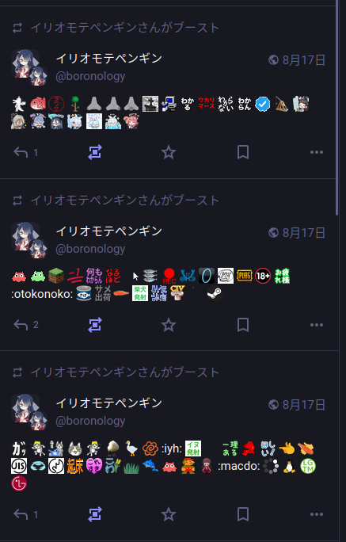
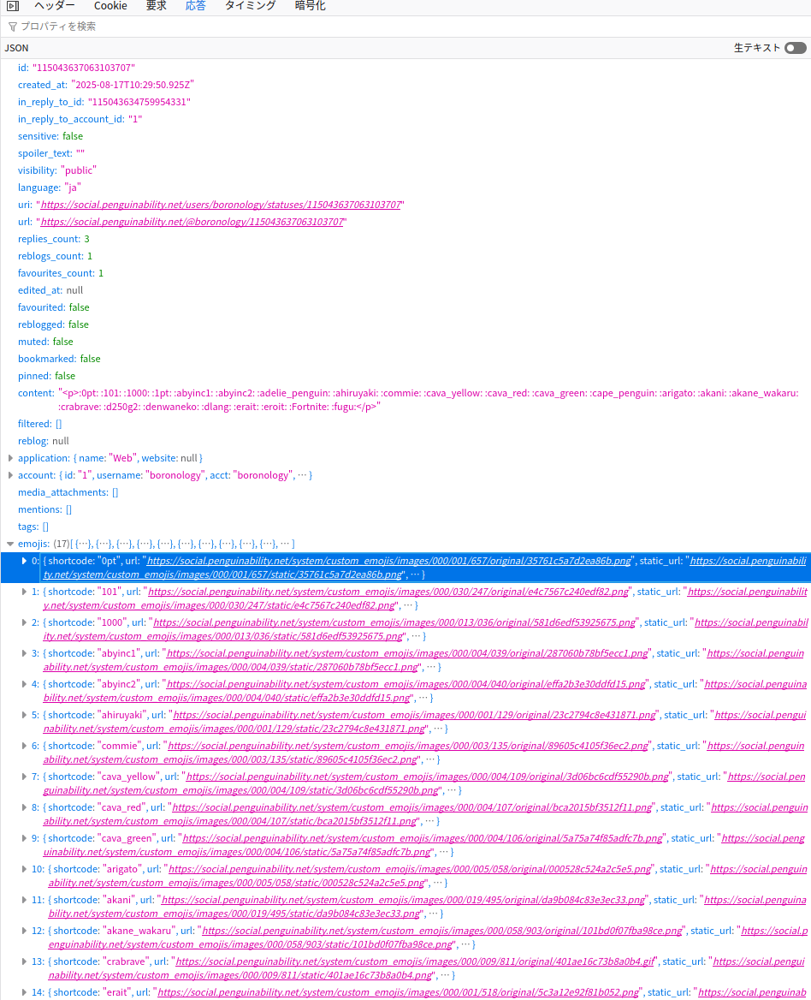
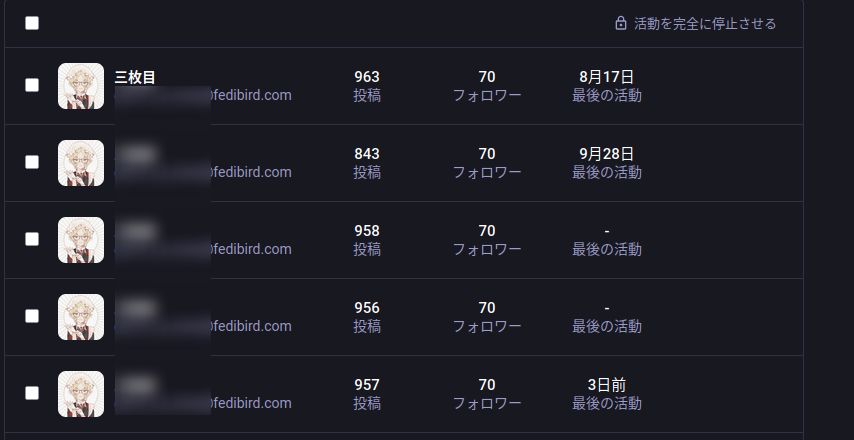
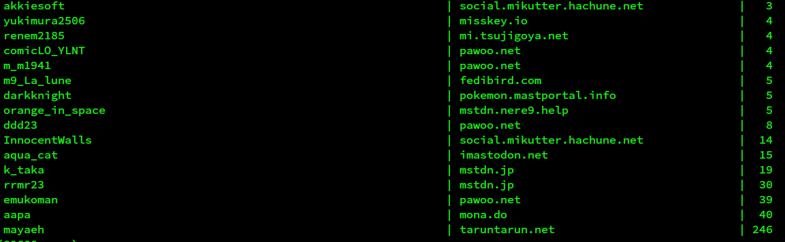
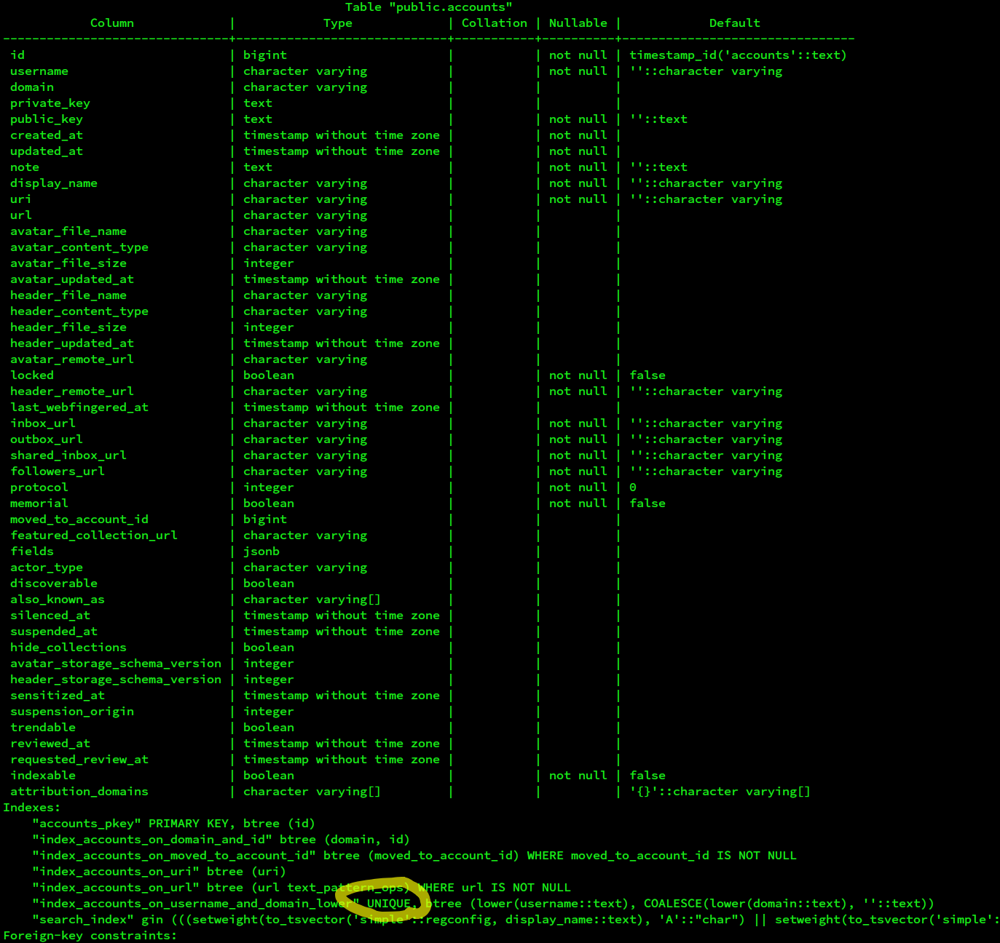
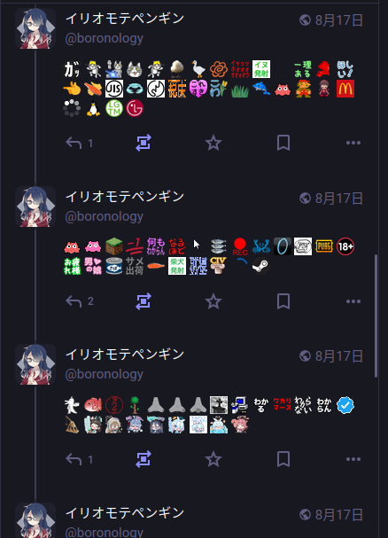

# 壊れたインデクスを直す

私の運用しているmastodonサーバーで奇妙な障害が起きていた。以下のような現象である。

- 一部のカスタム絵文字がshortcodeのままで表示される
- 一部のリモートユーザーの投稿がタイムラインに流れない

調査したところ、データベースの整合性が壊れていることがわかった。以下に状況と対処内容をまとめる。

## 何が起きたか

### カスタム絵文字がshortcodeのままで表示される

直接見てわかる現象は以下である。投稿で `:otokonoko:` 、`:iyh` 、 `:macdo:` が画像ではなく文字列で表示されている。実際にはこれらのカスタム絵文字はサーバーに登録されているため、画像にならないのは異常である。



別の投稿であるが、ブラウザ上でAPIレスポンスを見ると以下のようになっている。`content` が本文で、`emojis` に本文で使用しているカスタム絵文字の画像情報が格納されている。見比べると `1pt` 、`adelie_penguin` などが `emojis` に含まれていないことがわかる。つまりこれはバックエンド側で発生している問題である。



### リモートユーザーの投稿がタイムラインに流れない

サンプルはない。見えないから。

目に見える事象としては **モデレーション画面で同じアカウントが複数表示される** ことが挙げられる。



この現象からDB上でのデータが不正なのではないかと考え、実際のデータにあたることにした。

## 調査

DBで重複したアカウントを取得する。同じ `username` と `domain` の組み合わせに対して複数のエントリが登録されているアカウントが相当数見つかる。これは明白にテーブルの一意性制約に反していて異常である。

```sql
SELECT
    username
    , domain
    , count(*) as c
FROM accounts
GROUP BY username, domain
ORDER BY c;
```





ここから、アカウントを `accounts` テーブルから探す処理に失敗している、または予期しないレコードに紐づけていることが原因でタイムラインに投稿が流れなくなっているのではないかと予想をたてた。


## 対応

テーブルが一意性制約に違反している状態を修正する。具体的には以下の手順をとる。

1. `accounts` テーブルで重複する（同じ `username` と `domain` の組み合わせであるにもかかわらず `id` が異なる）アカウントのレコードを洗い出す
2. それぞれのアカウントに対して、 `accounts` テーブルを参照するテーブルを調べ、 `id` を統合したと仮定したときに一意性制約に違反するようなレコードをすべて削除する
3. それぞれのアカウントに対して `accounts` テーブルを参照するテーブルに対し、 `id` を1つに統合する
4. `accounts` テーブルで統合先の `id` 以外の `id` のアカウントを削除する
5. `REINDEX` して正常に制約が動作する状態に戻す

なおこれを考えた時点でカスタム絵文字の問題はすっかり忘れていた。

### 実際の方法

#### 1. 自動化するスクリプトを作る

`accounts.id` を参照するテーブルは実に78個ある。さすがに手作業ではできないのである程度自動化する。

作成したスクリプトは以下に残してある。

[boronology/fix_mastodon_indices: v4.4.xのインデクス異常を修正するためのスクリプト](https://github.com/boronology/fix_mastodon_indices)

#### 2. 実行して `REINDEX`

スクリプトを実行する。全ユーザーの投稿が格納された `statuses` テーブルも `accounts` テーブルを参照しているため、関連テーブルのスキャンにかなり時間がかかる。

無事終わったらインデクスを再生成する。

```sql
-- 再インデクス
REINDEX (VERBOSE) DATABASE mastodon;
```

#### 3. カスタム絵文字とpreview cardの修正

インデクス再生成が途中で止まったので随所で修正を行う。直したのは以下の2つである。

* カスタム絵文字（ `custom_emojis` テーブル）
* プレビュー （ `preview_cards` テーブル）

どちらも被参照は少ないので手作業で直した。方法は `accounts` と同じである。

```sql
-- custom_emojisの例
DELETE FROM custom_emojis
WHERE id IN (
    SELECT id
    FROM (
        SELECT
            id
            , shortcode
            , domain
            , row_number() OVER (PARTITION BY shortcode, domain) as r
        FROM custom_emojis) as ce
        WHERE ce.r > 1
    )
);
```

ちなみに `REINDEX DATABASE` でデータベース全体の再インデクスをすると同じテーブルを何度も再インデクスすることになり効率が悪い。インデクスぶんだけ `REINDEX` クエリを作って一気に実行するとよい。失敗したら失敗したところから先だけ実行しなおせばよい。

```sql
-- インデクスをすべて取得
SELECT indexname FROM pg_indexes WHERE schemaname = 'public';
```

```sql
-- 適当なテキストエディタで `REINDEX INDEX` と `;` を追加して
REINDEX INDEX account_deletion_requests_pkey;
REINDEX INDEX index_account_deletion_requests_on_account_id;
REINDEX INDEX account_pins_pkey;
REINDEX INDEX index_account_pins_on_account_id_and_target_account_id;
REINDEX INDEX index_account_pins_on_target_account_id;
REINDEX INDEX account_stats_pkey;
REINDEX INDEX index_account_stats_on_account_id;
REINDEX INDEX index_account_stats_on_last_status_at_and_account_id;
REINDEX INDEX account_moderation_notes_pkey;
REINDEX INDEX index_account_moderation_notes_on_account_id;
REINDEX INDEX index_account_moderation_notes_on_target_account_id;
REINDEX INDEX statuses_pkey;
REINDEX INDEX index_statuses_on_account_id;
REINDEX INDEX index_statuses_20190820;
REINDEX INDEX index_statuses_local_20190824;
REINDEX INDEX index_statuses_on_reblog_of_id_and_account_id;
REINDEX INDEX index_statuses_on_deleted_at;
REINDEX INDEX index_statuses_on_in_reply_to_account_id;
REINDEX INDEX index_statuses_on_in_reply_to_id;
REINDEX INDEX index_statuses_on_uri;
REINDEX INDEX index_statuses_public_20250129;
REINDEX INDEX account_migrations_pkey;
REINDEX INDEX index_account_migrations_on_account_id;
REINDEX INDEX index_account_migrations_on_target_account_id;
-- ......
-- ...
-- そのまま貼り付けて実行する
```

#### 4. 完了
念の為 `REINDEX DATABASE mastodon` で全体のインデクスに異常がないかを再確認して完了。
サーバーを再起動する。



## 原因

何が原因でこんな障害が起きたのかは不明である。

なんとなくPostgreSQLのバージョンを上げたときあたりが怪しい気がしているが……
