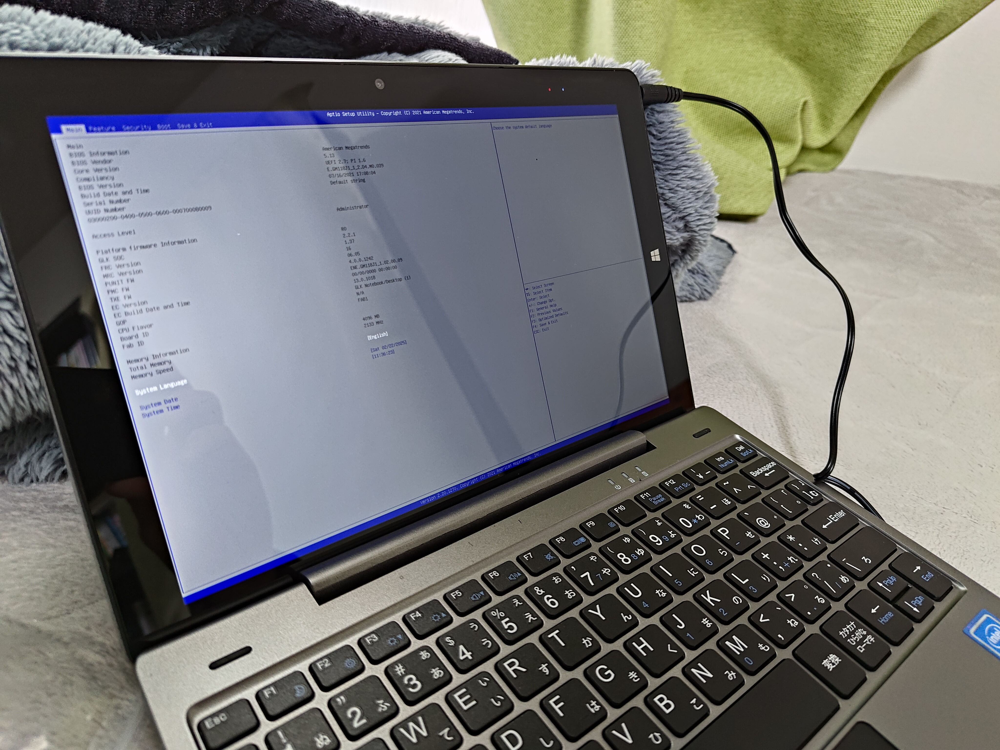
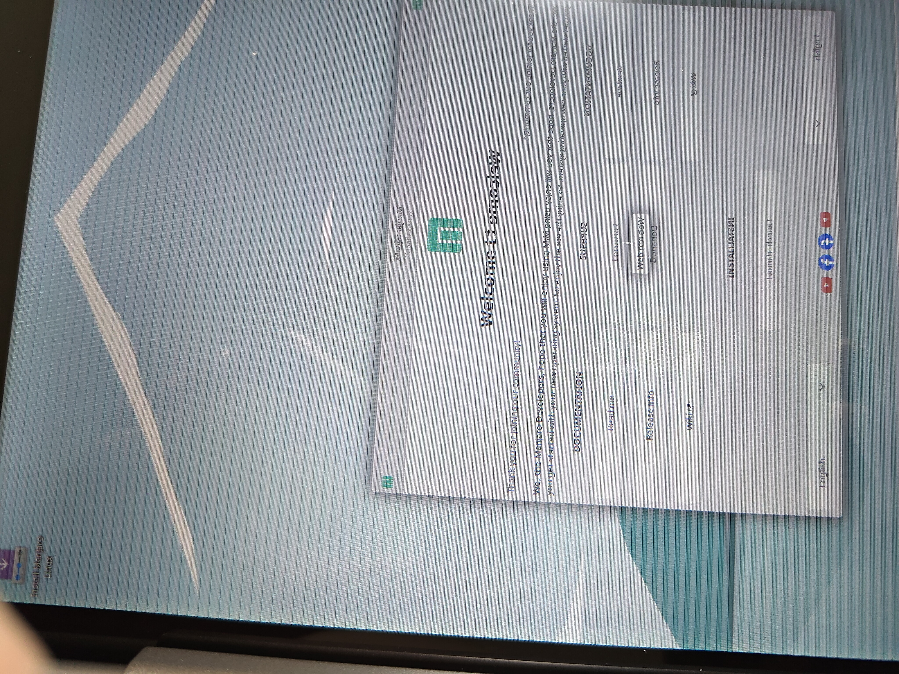
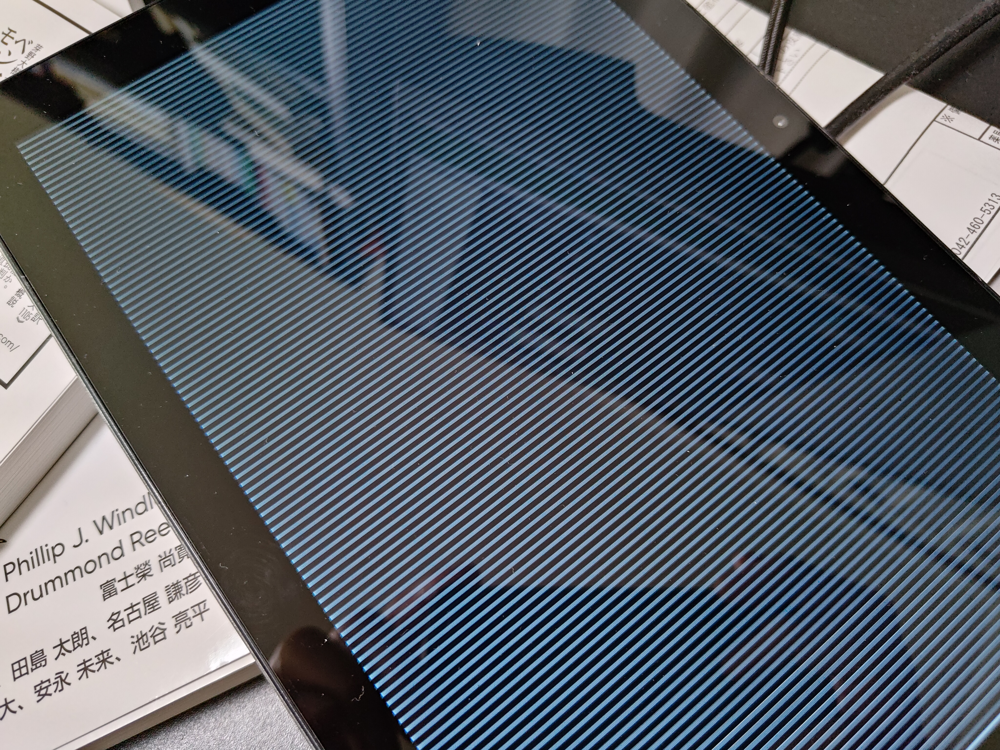

# ascon製GIGAスクール構想対応タブレットAT-08をLinuxで使う
2025年2月、ある中古Windowsタブレットが界隈を騒がせた。IOSYSが1000台以上を入荷したascon AT-08である。発売日に注文して運よく入手できたのでLinuxタブレットとして活用できないか試してみることにした。

[10.1インチWindowsタブレットが3,980円、中古品が1,000台も入荷！ - AKIBA PC Hotline!](https://akiba-pc.watch.impress.co.jp/docs/news/news/1665041.html)

## タブレットについて
詳細なスペックは各所の記事を参照のこと。以下に概要のみ載せる。

|||
|---|---|
|CPU|Intel Celeron N4120|
|メモリ|4GB|
|ストレージ|eMMC 64GB|
|モニタ|10.1型 1920x1200|
|I/F|micro HDMI, microSD, USB Type-A, USB Type-C|

一説によると本機種は同じ機種名で2世代が混在しているらしい。この情報が正しいとすると、私が引いたのはどうやら2021年版のようだ。



* スペック
  * [教育用タブレット開発 株式会社アスコンはあらゆる販促をサポート](https://www.ascon.co.jp/business/device/tablet/)
    * AT-08の個別ページはアクセス不可になっている
  * [手書きタブレット型PC アスコンAT-08の発表 - アセンテック](https://www.ascentech.co.jp/news/press/pr210217_01.html)
* BIOSの差について
  * [Xユーザーの国債@gainerさん: 「アスコン AT-08、どうやらBIOSのバージョン違いがあるらしく 2020年版→CPUパワーリミットとかを細く設定出来るAdvanced設定タブあり 2021年版→上記のような機能は全削除 となってるっぽい。 なお、同じ店舗の同じコンテナから取り出した2台で上記が混在してた。(友人は2020、自分は2021だった)」 / X](https://x.com/gainer_kokusai/status/1895448695275159906)

## 用意するもの

* micro HDMIから接続できるモニタ
  * 後述するがAT-08はモニタに問題を抱えている。少なくともインストールが完了するまでは外部モニタがあるとよい。
* 適当なLinuxディストーションのインストールメディア。
  * 私はManjaroを使用
  * （キーボードなしで日本語入力したい場合は）GNOMEを強く推奨
* 忍耐

## インストール

### OSのインストール
USBメモリを挿して電源を入れたらF12連打でBIOSに入る。BIOSからUSBメモリを選択してブートする。


GUIが起動するとサイケデリックな画面になる。残念ながらこれがAT-08である。バグではあるが異常ではない。



激しい縞模様を表示し続けるため放置しているとすぐに焼付きが起きる。本体モニタは無視し、外部モニタを見ながら手早くOSをインストールすること。特に罠などはなく完了するので詳しい説明は省く。

* サイケデリックな画面の例
  * [Xユーザーのアティ アークライトさん: 「アスコンAT-08 ChromeOS入れようとするとこうなるから使い道が無くなった… https://t.co/RsP4DsYe6y」 / X](https://x.com/Aty_Arkwright/status/1893615490830131277)
  * [Xユーザーのいまい@しま村さん: 「イオシスで入手したascon AT-08、ChromeOS Flexを立ち上げて遊ぼうと思ったが、画面が乱れるので操作できないでござる https://t.co/q5M3EmzMU2」 / X](https://x.com/_imai/status/1893648209106423847)
    * ChromeOSのインストーラはウィザードを外部モニタに表示しないため手詰まりになるようだ


### デスクトップ環境のインストール
私はWaylandを前提しているので、GNOMEとKDE Plasmaとの比較となる。前述のとおりタブレットとして使うのであればGNOMEを強く推奨する。その理由は日本語入力にある。

KDE PlasmaではIME（fcitx5）を仮想キーボードとして登録する都合上、同じ仮想キーボードであるオンスクリーンキーボード（Maliitなど）とは排他になる。仮想キーボードを使うと日本語入力ができず、日本語入力を使うと仮想キーボードが使えないわけだ。対してGNOMEはオンスクリーンキーボードがアクセシビリティの機能として提供されており、これはibusと共存できる。

#### 日本語IMEのインストール
デスクトップ環境にGNOMEを選ぶとIMEの第一選択はibusとなる。エンジンの選択肢を探すとManjaroの公式リポジトリにはskkとkkcしかないが、AURからmozcも導入可能である。
まず以下はibus-kkcとオンスクリーンキーボードで日本語入力をしている画面。


こちらはibus-mozcを導入した画面。


#### 代替

一応仮想キーボード付きのfcitx5もあるにはあるのだが、性能に余裕がないAT-08でビルドするには難があるためまだ試していない。（[おだら](https://mastodon.hakurei.win/@s3_odara)様、情報提供ありがとうございます。）

* 仮想キーボード付きのFcitx5の開発例
  * [YoctoのWestonをターゲットとしたFcitx5ベースの仮想キーボードの開発 - 2022-12-02 - ククログ](https://www.clear-code.com/blog/2022/12/2/fcitx5-virtualkeyboard-ui.html)


## インストール後の使用
前述のとおり、AT-08はGUIが起動してすぐは本体ディスプレイへの出力が異常である。しかし、どういうわけか **一度サスペンドしてレジュームすると正常な表示になる** 。

そこで、ログインマネージャが起動したら（この時点ではログインマネージャの表示は乱れている）一度サスペンドさせることで対策をとる。さいわいGDMは電源ボタンでサスペンドできるので、乱れた画面の色からGDMが表示された頃を見計らって電源ボタンを押せばよい。サスペンドしたあと再度電源ボタンを押してレジュームすると、正常な描画でログインマネージャが見えるようになる。

### 自動化

GUIが起動した直後にサスペンドしてレジュームする操作をSystemd unitに登録して自動する。以下の内容ではシステムをスリープさせて一定時間後に再開させるコマンド `rtcwake` を使い、サスペンド（`-m mem`）して1秒後（`-s 1`）に復帰を指定する。

*/etc/systemd/system* に置き、`systemctl enable recover-monitor.service` で有効化する。次回からはGDM起動直後に自動でサスペンドとレジュームするようになる。

```ini
[Unit]
Description=suspend and resume to recover AT-08 monitor
After=display-manager.service

[Service]
Type=simple
ExecStart=/usr/bin/rtcwake -m mem -s 1

[Install]
WatedBy=graphical.target
```

以下のGistに用意したのでこちらを使ってくれても構わない。

* [recover-monitor.service](https://gist.github.com/boronology/4a943701a53ba64c04ac6a5df789645d)

## 使用例


## 今後
* ibus-mozcを入れる
* 電子書籍リーダーとして使ってみる