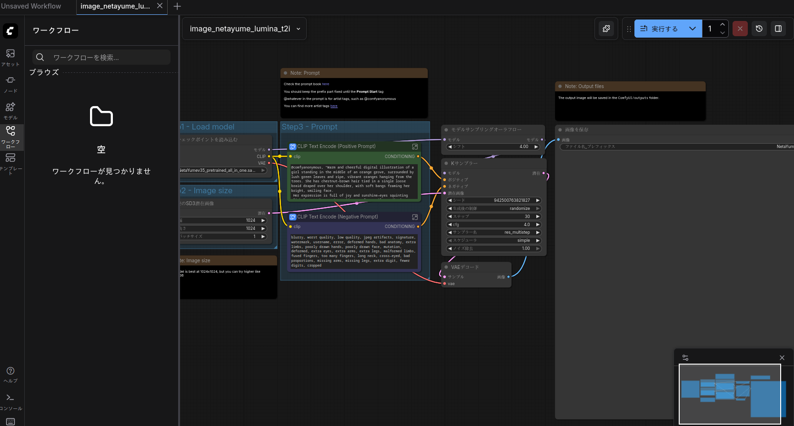
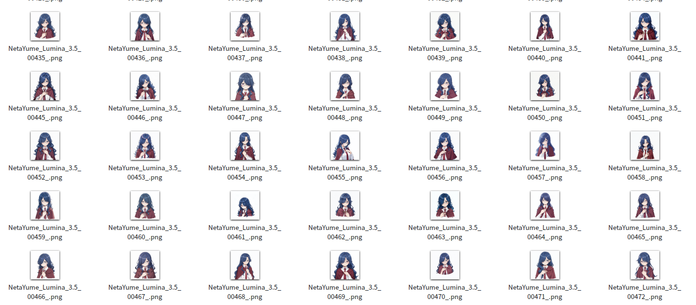

+++
date = '2026-01-04T11:02:00+09:00'
draft = false
title = 'アイコンを作ってみた話'
+++

## 旧アイコン

もともと使っていたアイコンは [妙子式おんなのこ - Picrew](https://icrew.me/image_maker/5090) で作ったものだった。


しかしこのPicrewは作者（ [妙子](https://lit.link/otaeko) 氏のはず）がみずから消したそうで、今はもう残っていない。改変するにもバリエーションを作るにも難しくなっている。

サイトを作るにあたっていっそアイコンごとリニューアルしようと考え、自作することにした。

## 作り方

だが私は絵が書けないので画像生成で作ろうと考えた。画像生成は未経験だがなんとかなるだろうと思い、ComfyUIを導入する。



アニメ調に向いたプリセットを読み込んだところで固まった。何を指示すればいいのかプロンプトが思いつかないのだ。ネガティブプロンプトに至ってはなおさらである。さて、問題は3つになった。

幸い、現在はマルチモーダルな言語モデルが出回っている。そして私はPC上でローカルLLMを動かしている。となれば答えは簡単でLLMにプロンプトを書かせればよい。手頃なサイズのモデルとして [unsloth/Qwen3-VL-30B-A3B-Thinking-GGUF](https://huggingface.co/unsloth/Qwen3-VL-30B-A3B-Thinking-GGUF) のQ4_K_M量子化を使用した。使い方の詳細はunslothが利用ガイドを出しているのでそれに従えばよい（ [Qwen3-VL: How to Run Guide | Unsloth Documentation](https://unsloth.ai/docs/models/qwen3-vl-how-to-run-and-fine-tune) ）。

```sh
lama-mtmd-cli \                          
    -m Qwen3-VL-30B-A3B-Thinking-Q4_K_M.gguf \
    --mmproj mmproj-F16.gguf \
    --jinja \
    --top-p 0.8 \
    --top-k 20 \
    --temp 0.7 \
    --min-p 0.0 \
    --presence-penalty 1.5 \
    --ctx-size 8192
```

イメージを読み込んで「ポジティブプロンプトとネガティブプロンプトを出せ」と指示する。

```
/image /path/to/old_icon.png
> inspect this image and write positive prompt and negative prompt to generate this image using NetaYume-Lumina-Image-2.0 model.
encoding image slice...

......
```

当初出てきたプロンプトはなくしてしまったのだが、何度か試してみてもおおむね近い結果が出る。30Bのモデルが大きいなら [unsloth/Qwen3-VL-8B-Instruct-GGUF:UD-Q4_K_XL](https://huggingface.co/unsloth/Qwen3-VL-8B-Instruct-GGUF) でも大差のない結果が出たし、8BならCPUでも十分快適に動作するのでこれでいいかもしれない。

ともあれこれでプロンプトの雛形はできたので、あとは自分で読んだうえ文章をいじったり画風を指定したり背景を真っ白にするよう変更したりと調整し、ComfyUIに入力する。

あとは試行錯誤だ。目下のところROCmはドライバとライブラリの間に不整合が起きていて不規則にプロセスが落ちる（参考：[ROCm + RDNA 4 GPU で発生していたメモリアクセスエラーが修正される | Coelacanth's Dream](https://www.coelacanth-dream.com/posts/2025/12/13/rocm-rdna4-memory-access-error/)）。カーネルパラメータに `amdgpu.cwsr_enable=0` をつけても頻度が下がるだけで相変わらずクラッシュはするので、仕方ないので根気強く生成とプロンプトの調整を繰り返す。

サンプラーは試したところ `dpmpp_2m_sde_gpu` が収束も早く、出来上がりも安定してよさそうな印象を受けた。 `dpmpp_3m*` 系は出来上がりは良いものの収束するまでのイテレーションが多い。 `euler` は（主観的だが）どうにもぼんやりした絵になってしまう感じ。試して初めて実感することもあるものだ。

## 出力からその後



だいたい500枚くらい出力してようやく満足いく出来のものが出てきた。フィードバックを得ながら随時プロンプトや設定を修正していくというのはアジャイル開発にも似たところがある。

出来上がった画像はKritaで編集し、背景の白を切り抜いて透過にする。レイヤーにして保存しておいたので後から再加工もできるだろう。

## 初めてのtext-to-image

画像生成について「誰でもイラストを作れるようになる」という評価を見たことがあるが、嘘八百とまでいわずとも嘘百くらいはあるというのが使ってみた実感だ。望む画像を生成するには多少なりとハードルがある。

- 出力させたいものを明らかにする
- 出力させたいものを言語で表現する
- 出力させたくないものを（画像生成のドメイン知識込みで）表現する
- 出力されたものと出力させたかったものの差異を言語としてプロンプトに反映する

絵を描くために必要だった訓練を、言語の訓練で代替できるようになっただけではないだろうか。実際のイラストレーターに描いてもらう場合にはこの回数のリテイクは不可能なので、初手でプロンプトと同程度の粒度で要件定義を起こさなければならない。そう考えると、無制限に試行錯誤ができることで確かにハードルは下がっているのだが……

image-to-imageモデルで生成するのであればもっと楽なのかもしれない。こちらはまだ試していないのでノーコメントとしておく。