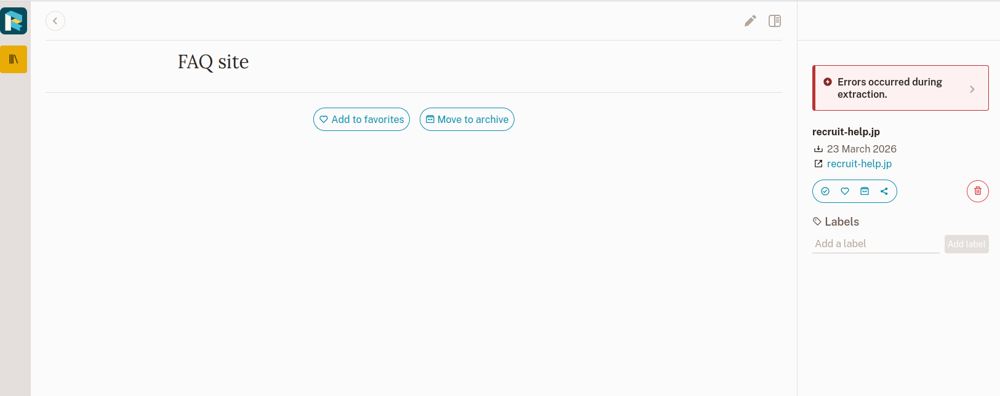
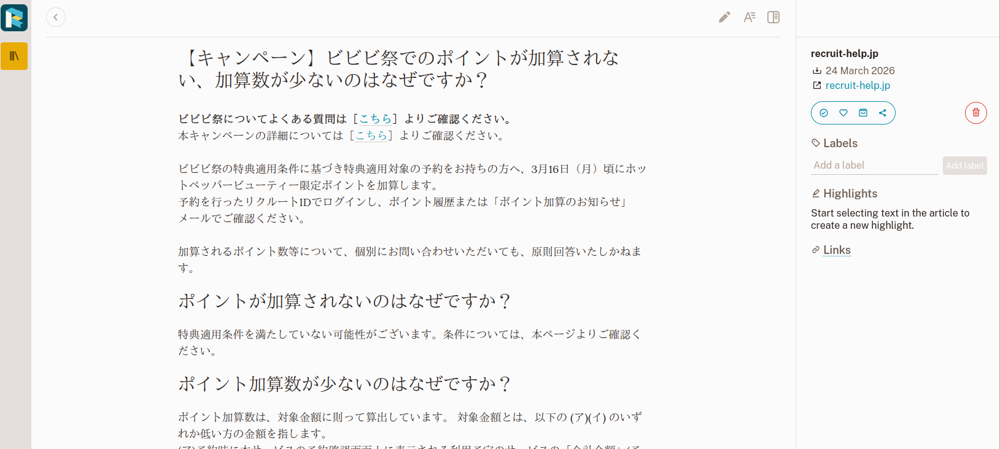

+++
date = '2026-03-23T18:01:24+09:00'
draft = false
title = 'Pocket代替（Webサイト保存）セルフホストアプリケーション'
+++

## Pocketの終わり

インターネット上のコンテンツはとにかく消えやすい。いわゆる魚拓目的でなくても、手元に残しておきたいということは多いだろう。

かつてはWebサイトの保存にPocketがよく使われていたが、昨年サービスを終了してしまった。
代替として今使っているのはWallabagだが、ときどき対応していないサイトがある。

そこでよりよいソフトウェアを検討する。条件としてはDockerでセルフホストが可能なこと、保存できるサイトの範囲が広いこと、などだろうか。


## ツール

ここで比較するツールは以下のとおり。

- [Karakeep](https://github.com/karakeep-app/karakeep)
- [Linkwarden](https://github.com/linkwarden/linkwarden)
- [Readeck](https://codeberg.org/readeck/readeck)
- [Shiori](https://github.com/go-shiori/shiori)
- [Wallabag](https://github.com/wallabag/wallabag)

## まとめ

### 一覧表

面倒な人向けにまとめておく。

|名前|言語|DB|SPA取得|全文検索|メモリ消費目安|日本語対応|
|---|---|---|---|---|---|---|
|Karakeep|TypeScript|SQLite|可|Meilisearch|1.5GB|多少怪しいがあり|
|Linkwarden|TypeScript|PostgreSQL|可|Meilisearch|1.5GB|あり|
|Readeck|Go|SQLite/PostgreSQL|条件により可||100MB|なし|
|Shiori|Go|SQLite/MariaDB/PostgreSQL|不可||50MB|なし|
|Wallabag|PHP|SQLite/MariaDB/PostgreSQL|不可||150MB|あり|

### 雑感

個人的には以下のように考えている。

- SPAのサイトを保存できなくていいならどれでもよい
- SPAのサイトも保存したいが少ないリソースで動かしたいのであればReadeck+ブラウザ拡張機能がリーズナブル
- リソースに余裕があればKarakeep

ところで全文検索エンジンを利用していないReadeck、Shiori、Wallabagであっても本文検索は可能である。
SQLアンチパターンでいうところの「貧者の検索エンジン」なのだろうが、一人で使ううえではそうそう困らない程度ではある。
同じサーバーを複数人で使うのであれば、MeilisearchやElasticSearchのついたアプリケーションのほうが無難だろう。

私はReadeckに乗り換えてみようと思っている。

## 比較

### Karakeep

TypeScript製。メモリ使用量を見ると本体で500MB、Meilisearchで600MB、Chromeで500MB以上を食う大食らい。
Chrome？と思うかもしれないが、 `compose.yml` を見ればわかると思う。内部では別コンテナで動くChromeをリモートデバッグで操作している。



```yaml
services:
  web:
    image: ghcr.io/karakeep-app/karakeep:${KARAKEEP_VERSION:-release}
    restart: unless-stopped
    volumes:
      # By default, the data is stored in a docker volume called "data".
      # If you want to mount a custom directory, change the volume mapping to:
      # - /path/to/your/directory:/data
      - ./data:/data
    ports:
      - 3000:3000
    env_file:
      - .env
    environment:
      MEILI_ADDR: http://meilisearch:7700
      BROWSER_WEB_URL: http://chrome:9222
      # OPENAI_API_KEY: ...

      # You almost never want to change the value of the DATA_DIR variable.
      # If you want to mount a custom directory, change the volume mapping above instead.
      DATA_DIR: /data # DON'T CHANGE THIS
  chrome:
    image: gcr.io/zenika-hub/alpine-chrome:124
    restart: unless-stopped
    command:
      - --no-sandbox
      - --disable-gpu
      - --disable-dev-shm-usage
      - --remote-debugging-address=0.0.0.0
      - --remote-debugging-port=9222
      - --hide-scrollbars
  meilisearch:
    image: getmeili/meilisearch:v1.37.0
    restart: unless-stopped
    env_file:
      - .env
    environment:
      MEILI_NO_ANALYTICS: "true"
    volumes:
      - ./meilisearch:/meili_data
```


もっともChromeがJavaScriptを動かすおかげでSPAのサイトも保存できる。

なおどうでもいいがi18nについてはあまり人間が活躍していないようで、 ["ほんまにユーザー「{{name}}」を削除してええん？"](https://github.com/karakeep-app/karakeep/blob/17f4963b4c0a26b8f0d10ea0ac0568cde4e37803/apps/web/lib/i18n/locales/ja/translation.json#L174) や ["ブックマークIDを入力してや"](https://github.com/karakeep-app/karakeep/blob/17f4963b4c0a26b8f0d10ea0ac0568cde4e37803/apps/web/lib/i18n/locales/ja/translation.json#L193) などの怪しい翻訳が楽しめる。

### Linkwarden

こちらもTypeScript製。そして本体で1GB、Meilisearchで600MBくらいのメモリを食う大食らい。Karakeep並みなのも当然で、本体の内部ではPlaywrightでChromiumを操作している。日本語対応あり。

保存方法はHTML、スクリーンショット、PDF、Readable（リーダーモードだろうか？）の4種類。なぜかHTMLとReadableはSPAサイトをうまく取得できない。PDFとスクリーンショットはSPAサイトをレンダリング後の状態で保存できる。


###  Readeck

Go製。メモリ消費100MBくらいと軽量。多言語対応はあるが、現状では日本語なし。いまなら貢献できる。

当然ながらSPAには対応していない、のだがそれはReadeckのWebインターフェースの話。ブラウザ拡張機能はレンダリング後の状態を送信しているらしく、SPAのコンテンツを保存できる。

たとえば同じSPAサイト（ `https://recruit-help.jp/hpb/s/article/100003988` ）で比較すると以下のようになる（上がWebインターフェースで保存、下がブラウザ拡張機能で保存した場合）。





### Shiori

50MBくらいと超軽量。最低限の機能といった見た目で、Web UIも非常にシンプルになっている。UIの多言語対応もなし。

もちろんSPAには対応していないのだが、Webページの保存どころかリンクの保存もできない（ `Unknown error occurred` になってしまう）。最低限リンクだけでも残せないと困ると思うのだが……

### Wallabag

PHP製。メモリ消費は150MB弱。Pocketやそれ以外の各種サービスからのインポートにも対応している。日本語対応あり。

サイトの取得には [j0k3r/php-readability](https://github.com/j0k3r/php-readability) を使っているようで、JavaScriptの解釈はできない。そのためSPAサイトは `wallabag can't retrieve contents for this article. Please troubleshoot this issue.` になってしまう。

ブラウザ拡張機能もあるが、Readeckと異なり拡張機能を経由してもSPAは保存できない。URLだけをサーバーに送信する仕組みらしい。