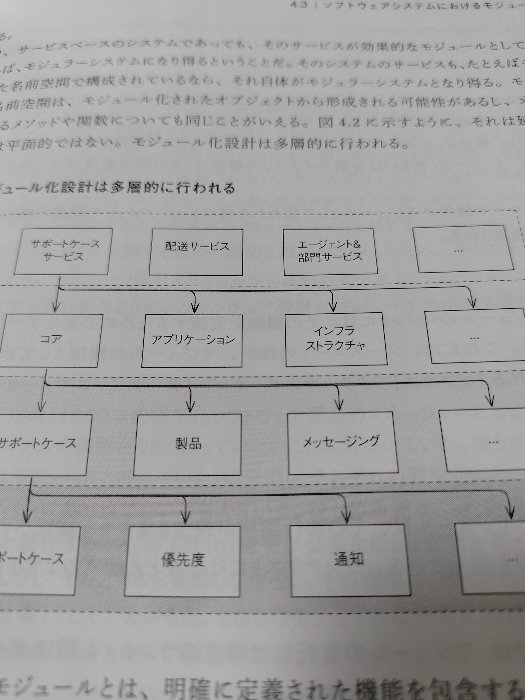

+++
date = '2026-03-28T14:46:03+09:00'
draft = false
title = '『ソフトウェア設計の結合バランス』を読んだ'
+++

『ソフトウェア設計の結合バランス : 持続可能な成長を支えるモジュール化の原則』Vlad Khononov著・島田浩二訳、2025.10、インプレス。

## 内容について

分析そのものに異議はない。結論に関しても類書とそうそう変わるところはない。

各所に衒学趣味が散りばめられているきらいはあるが、悪い本ではないだろう。

## 本として

内容とは別の軸では酷評せざるをえない。

禁則処理の問題、そして図版の問題である。インプレスという会社がどういうつもりでこの本を編集したのか疑問である。

特に気になる点を以下に挙げる。

### 図版

p59の図版を以下に示す。矢印の線に注目してほしい。

- 線の太さがあっていない
- 線が上下にぶれて二重線になっている

手抜きがすぎる。むしろどうやって描いたのだろうか。

### 禁則処理

通常であれば欧文は単語の途中で行が変わらないように組版するはずである。
しかしこの本においてはその原則を完全に無視している。以下にp1から順に例を挙げる。


> 　「結合している／結合された」（coupled）という言葉は常に「接続している／接続された（conn
> 
> ected）と置き換えが可能だ。（略）



> ている点にある。図1.2に示す2つの設計を考えてみよう。どちらの設計にもPaymentsとAuthoriz
> 
> ationという2つのモジュールが存在している。（略）



> クシステム内に配置されているのに対し、Bの設計では、各モジュールは2つの異なるサービス、Bi
> 
> llingとIdentity&Accessに配置されている。



> にテスト・デプロイ・メンテナンスする必要があるからだ。一方、Bに示すPaymentsとAuthorizati
> 
> onのように、モジュールを異なるサービスに分離すると、それらのライフサイクルの結合度は弱まり、



> クトとの異なる結合インターフェイスを示している。つまりそれぞれの設計は、異なる量の知識をCus
> 
> tomersServiceの外部に公開している。


5ページ目まででこれだからあとは推して知るべきだろう。

疑う向きは[出版社サイト](https://book.impress.co.jp/books/1124101149)の[ページイメージ](https://book.impress.co.jp/upload/page-image/1124101149_02.png)を参照してほしい。

「。」「、」といった役物が行頭に来る箇所は見つからなかったので、和文はチェックできているようだ。社内でレビューなどはないのだろうか。

