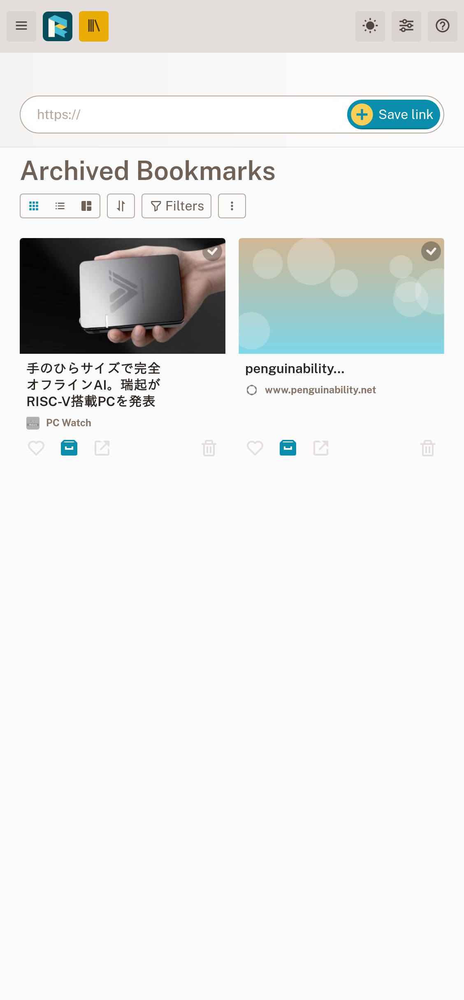

+++
date = '2026-04-04T21:33:31+09:00'
draft = false
title = 'Readeckを使っている'
+++

## 2週間

先日 [Pocket代替（Webサイト保存）セルフホストアプリケーション](/docs/20260323_selfhost_pocket/) という記事を書いた。
そのなかで気に入ったReadeckを使いはじめて2週間ほどが経ったので感想を書く。

### 軽い

とにかく軽量である。実際に運用しているとメモリ使用量は多少増えたが、それでも120MiB程度に収まっている。貧弱なVPSでも余裕で動く。

```
CONTAINER ID   NAME                 CPU %     MEM USAGE / LIMIT     MEM %     NET I/O          BLOCK I/O        PIDS
1345c6276620   readeck-readeck-1    0.00%     121.8MiB / 1.925GiB   6.18%     282MB / 66.9MB   120MB / 191MB    10
```

Web側も軽快に操作でき、ページ遷移に待たされるようなことはない。

### ページ取得が強い

これは主にブラウザ拡張機能が優秀であることによる。
ブラウザ拡張機能はブラウザがレンダリングしたあとの状態をサーバーに送信する。そのためSPAのサイトであってもページの内容を保存できることが多い。これは [前掲の記事](/docs/20260323_selfhost_pocket/) で書いたとおりだ。

逆にブラウザ拡張機能で正しく取得できないサイトもあるが、この場合もサーバー側に取得させることで保存できることがある。

ブラウザ拡張機能とサーバー側の持つフェッチ機能の2つのコンテンツ取得方法があるわけで、そのぶん対応サイトも広いといえるかもしれない。

### 操作性

削除に関わる操作がおもしろい。削除ボタンを押すと対象のアイテムは削除待ち状態になり、しばらくすると削除される。本当に削除されるまでの間は削除の取り消しができる。

反面といってはなんだが誤操作はしやすい。特にスマートフォンで表示するとボタンが小さい。



### アクセシビリティ

ページを観察すると事細かに `title` や `aria-labeledby` が付けられていた。今のところお世話になる身ではないが、ありがたいものではある。（ただし一部で不可視の `span` を使って説明をつけていたりもするのでどこまで考えられているのかは……）

## まとめ

当面は使ってみようと思う。

## おまけ

気に入ったので翻訳を始めた。以下に現状の進捗を載せておく。


<a href="https://translate.codeberg.org/engage/readeck/">

</a>


訳すには実際の画面を見て文脈を確認する必要があるわけで、思ったとおり大変というところ。

### おまけのおまけ

ときどき怪しい原文があるが、どうしたらいいのだろう。 ["Upload this file in the form below and Readeck will create and fetch every bookmark found it the file."](https://codeberg.org/readeck/readeck/src/commit/a2252e6dbed511c2c434b0bab5dee5e713aefbd7/locales/translations/ja/messages.po#L1213) とか。