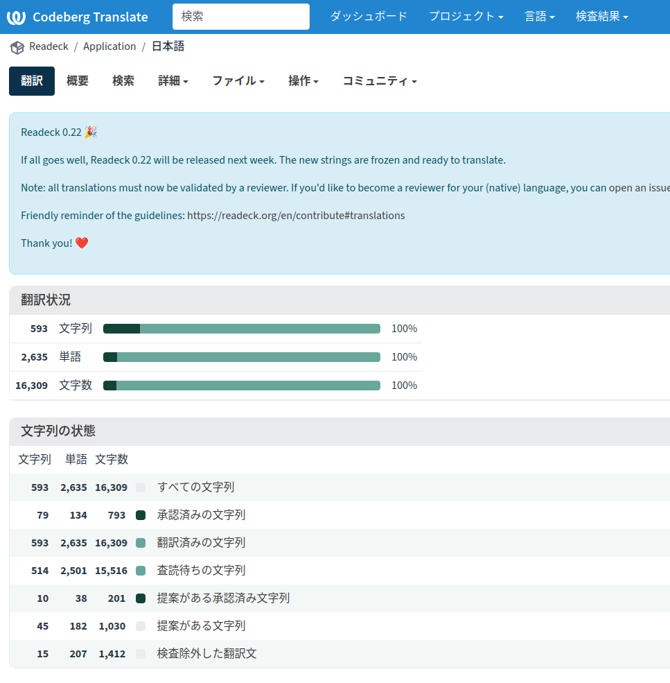

+++
date = '2026-05-01T00:00:31+09:00'
draft = false
title = 'Readeckを翻訳した'
+++

## ㊗️

先日からやっていたReadeckの翻訳が終わった。やったね。

あとは管理者に承認してもらえば晴れて利用可能となるはず。

## 感想

翻訳をやってみると大変なの半分、面白いの半分といったところだった。

当然ながら翻訳するには実際のコードや画面を見て文脈を把握しなければならない。
なので訳文を考えるうえでは英文を見ては該当機能を探しに行き、可能な限り実際に使ってみることにしていた。
しかし機能を知らない、アクセス方法を知らない、有効になる条件を知らないなどで試行錯誤が必要だった。

とはいえ、おかげで大半の機能を把握できたのは収穫だった。
当初はWallabagからのインポートができないと思い込んでいたが、ちゃんと実装されていたこともわかった。
もっとも手動でインポートし終わったあとで見つけたので後の祭りだったが……
（各種サービスからのインポートが「Import」メニューの「dedicated section」という小さなリンクの先にあるのはなかなか気づかないとおもう）

1か月ほど前、私が着手したときには翻訳率は20％弱だったと記憶している。
20％くらいはすでに提案があった翻訳にOKボタンを押したりちょっと手直して取り込んだりしたものなので、およそ半分が私の作業といっていいと思う。

翻訳に関しては逐語訳よりも文脈に応じた訳を心がけた。
学術的な翻訳であれば動的等価翻訳は唾棄すべきだが、実用品についてはそんなことはなくむしろ解説は不要でなければならないと思っている。
つまり読みづらければ私が悪い。いまちょっと緊張している。
