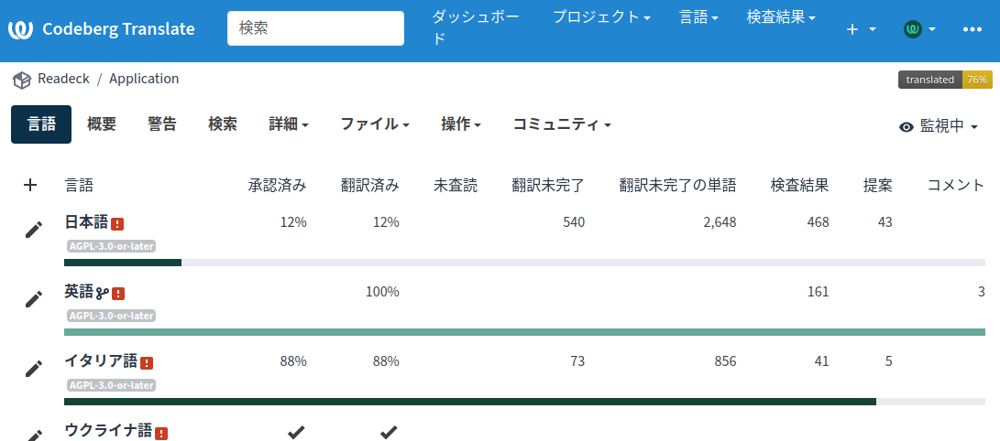

+++
date = '2026-05-19T19:51:41+09:00'
draft = false
title = 'Readeckの翻訳が消えた'
+++

## What?

{ class="with-border" }

Readeckの翻訳は消えたんだ。
いくら呼んでも帰っては来ないんだ。
もうあの時間は終わって、君も人生と向き合う時なんだ。

## 何が起きた？

「[Readeckを翻訳した](/blog/20260430_translate_readeck)」で書いたとおり、4月末にReadeckの翻訳を完了して承認待ちの状態になった。

その後、承認が下りるまえに5月16日の [Updated translations · da5c7c5ee7](https://codeberg.org/readeck/readeck/commit/da5c7c5ee705360a801978e6e1f0855159588046) によってリソースが上書きされ、それによって承認待ちの翻訳がすべて消滅した、ということらしい。

## まとめ

かなしい。

仕方ないのでもう一度やろうと思う。中村元だって仏教語大辞典を一から書き直したのだから。
