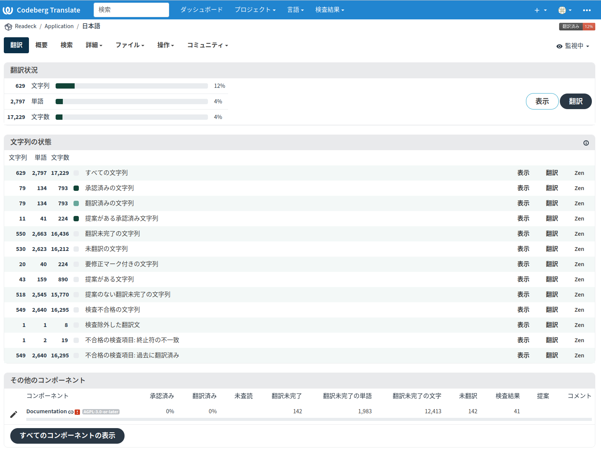
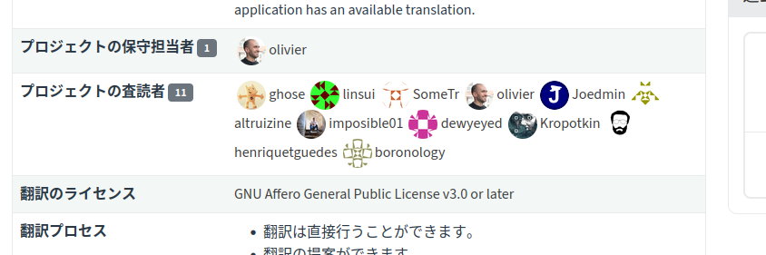

+++
date = '2026-06-26T20:17:15+09:00'
draft = false
title = 'Readeck翻訳のレビュワーになった'
+++

## これまでのまとめ

- [Readeckを翻訳した](/blog/20260430_translate_readeck)
- [Readeckの翻訳が消えた](/blog/20260517_translate_vanish)
- [Readeck翻訳完了（2回目）](/blog/20260607_translate_readeck)

## 2026-06-25



```
 （´・ω・｀)
うん、「また」なんだ。済まない。
仏の顔もって言うしね、謝って許してもらおうとも思っていない。
```

## Issue

さすがにこれではどうにもならないのでIssueを立ててみた。

[#1264 - Can anyone review Japanese translation? - readeck/readeck - Codeberg.org](https://codeberg.org/readeck/readeck/issues/1264)

> 2. Or, can I become a reviewer?

ちょっと厚かましいかな……

## Now...

> You're now a reviewer of Japanese. Thank you so much :)

！？



そういうわけでReadeckの日本語翻訳レビュワーになりました。
