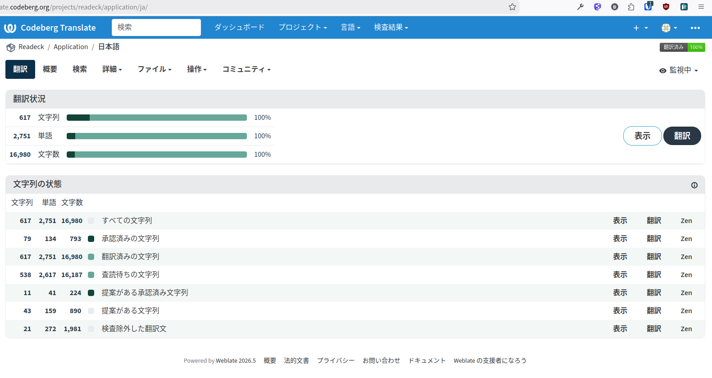

+++
date = '2026-06-07T13:25:44+09:00'
draft = false
title = 'Readeck翻訳完了（2回目）'
+++

## 要約

一度翻訳完了したはずが、上流からの上書きで全部消えたのは [Readeckの翻訳が消えた](/blog/20260517_translate_vanish) に書いたとおり。

だがこのたび再度全部の翻訳を完了した。今度こそ消さないでくれよ。





## 次期バージョン

上流での開発にともなって翻訳リソースが追加されていたので、新しく追加される機能もわかってくる。次回のバージョンではOIDCによる外部アカウント連携ができるようになるそうだ。
