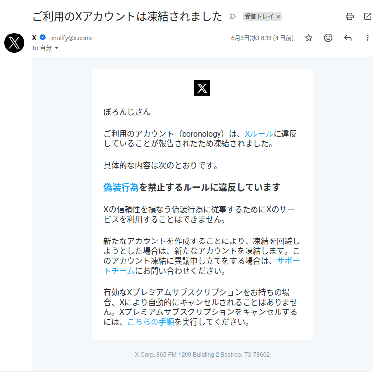
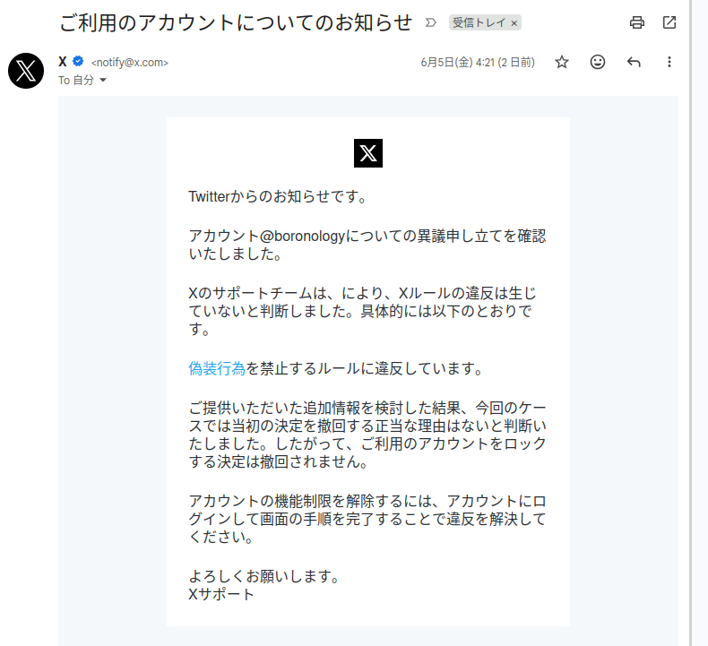

+++
date = '2026-06-07T13:35:31+09:00'
draft = false
title = 'Twitterアカウントが凍り、融けた。'
+++

## 凍った

2026年6月3日の朝、通勤していると携帯電話が震えた。職場に着いて開いてみると、不穏なメール通知がある。

折しも前日に [俺にとってのX(あるいはTwitter)が終わったので、次を考える - rinsuki’s blog](https://rinsuki.hatenablog.jp/entry/2026/06/02/215544) を見て笑っていたのでタイムリーにもほどがある。

## hey, twitter! ban stop me premiamu!

といっても偽装行為なんぞやった覚えはない。そもそもここ数年というものツイートすらしていない。ふぁぼとRTだけで使っているんだから何を偽装しろというのか。

よく知られている言葉に「お前の肩で車輪を支えよ」とあるとおり、天命を待つ前に人事を尽くすことにした。一応異議申し立てをする。

## 融けた

5日になって届いたのは以下のメール。

> Xのサポートチームは、により、Xルールの違反は生じていないと判断しました。具体的には以下のとおりです。
> 偽装行為を禁止するルールに違反しています。
>
> ご提供いただいた追加情報を検討した結果、今回のケースでは当初の決定を撤回する正当な理由はないと判断いたしました。したがって、ご利用のアカウントをロックする決定は撤回されません。
> 
> アカウントの機能制限を解除するには、アカウントにログインして画面の手順を完了することで違反を解決してください。
> 
> よろしくお願いします。
> Xサポート 

ひと目見たところではよくある自動回答だった。そりゃそうだろう「ご提供いただいた追加情報を検討した結果、今回のケースでは当初の決定を撤回する正当な理由はないと判断いたしました。」とあるんだから。

が、なぜだか6日には利用可能になっていた。優先して読むべきは「Xのサポートチームは、により、Xルールの違反は生じていないと判断しました。」のほうだったのだろうか？不思議な文章もあるものだ。

## 教訓

ビッグテックに依存するな。特に気まぐれな企業には。
