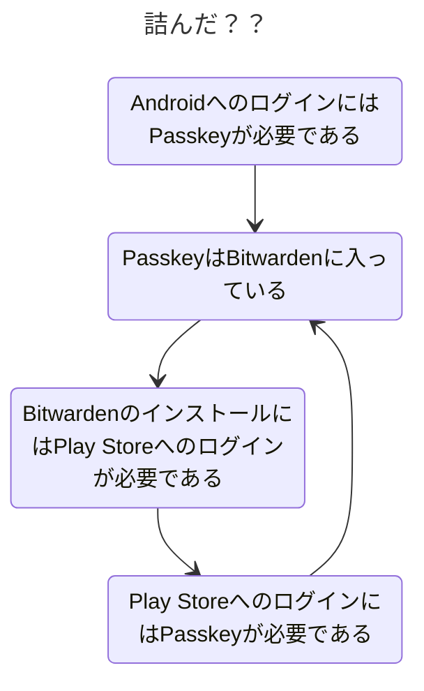

+++
date = '2026-07-29T20:36:38+09:00'
draft = false
title = '携帯電話を換えた'
+++

## 起きたこと

ある朝目を覚ますとZenfone10が死んでいた。死因は明らかではない。外傷はなかった。

画面にの左1/3あたりに縦方向のノイズが走り、その付近がタップされ続けているような動作をするようになった。

正直に言って大変困るので新しい端末を買うことになった。

## 候補

まあまあの性能は欲しい。

- Zenfone 12
- Galaxy A57 5G
- Pixel 10a
- AQUOS R10

在庫切れと値段によりZenfoneが最初に脱落。Pixel 10aは性能面の不安とAIアピールが心配で外した。

最終的にヨドバシのポイントを爆破できるという点でGalaxy A57 5Gを選択した。Samsung端末はゴールドポイント付与率が1％なので溜まったポイントの使い道として適している。

### 使った感想

- Samsungのアカウント連携要求がうるさい。これならアカウント一つで済むぶんPixelのほうがマシだったかもしれない。
- ストレージ128GBでmicroSDスロットなしはあまりに心許ない。これならAQUOS R10のほうがよかったかもしれない。

とはいえ、値段を考えればまあこんなものではないかと思う。

## 抹消、そして

操作ができなくなった携帯電話の何が困るかというと、リセットできないので捨てるに捨てられないという点だ。
しかも中にはリチウムイオン電池が入っているので壊れた可燃物を自宅に安置する必要があるというオマケまでついてくる。

幸いにも[Find hub](https://www.google.com/android/find/about)の連携をしていたので遠隔でリセットをかけられた。ビッグテックによる監視社会にもいい点はあるものだ。

さて、これで事なきを得たと思っていた。新しい端末にログインしようとするまでは。

### 多要素認証ブートストラップ問題

回復用のキーを使ってなんとかした。常日頃からの用意は大事だと実感した。
