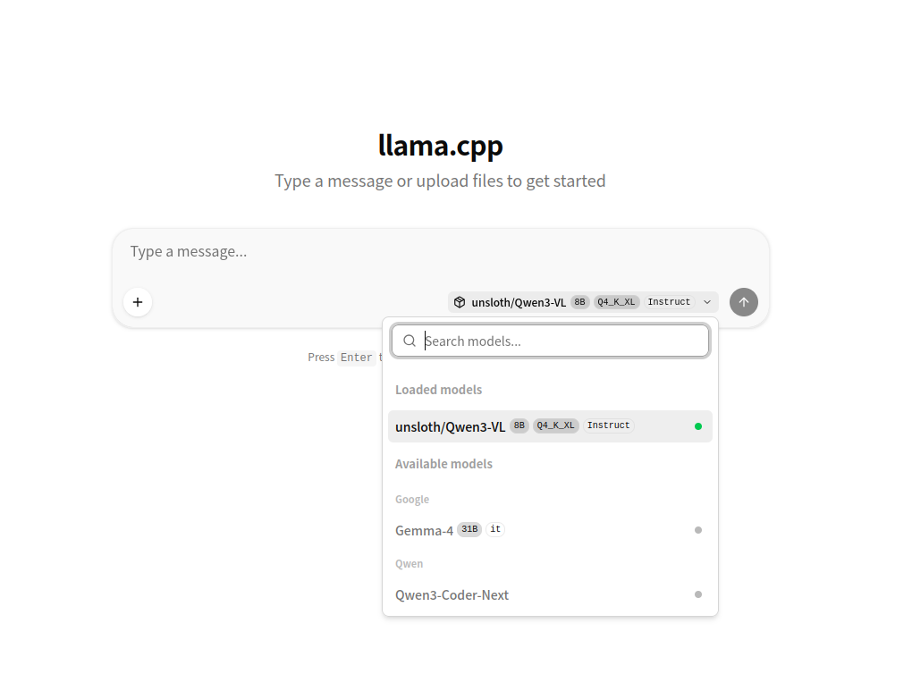

+++
date = '2026-04-05T11:29:48+09:00'
draft = false
title = 'ローカルllama.cppでは--models-presetを使え'
+++

## --models-preset

`--models-preset` は複数のモデルの設定を一括してファイルから読み込むためのオプションである。実装されたのは2025年12月頃。

llama-serverを起動したままモデルを切り替えたり、同時にロードしたり、必要なときだけロードして自動でアンロードしたりと大変便利なので活用すべきだ。

使い方は以下。

```sh
llama-server --models-preset my_model_preset.ini --no-models-autoload --sleep-idle-seconds 600
```


### 意味

- `--models-preset`
  - モデルの設定をファイルから読み込む
- `--no-models-autoload`
  - llama-server起動時にはモデルを読み込まない（ユーザーが選択した時点で読み込む）
- `--sleep-idle-seconds`
  - 一定時間アイドルが続くとモデルをアンロードする

### 設定方法

使うモデルごとにセクションを分け、モデルごとの設定は `llama-server` の引数に指定するオプションの先頭ハイフン抜きをキーにして書く。

詳しくは [llama.cpp/tools/server at master · ggml-org/llama.cpp](https://github.com/ggml-org/llama.cpp/tree/master/tools/server#model-presets) を見ればいい。


```ini
; 画面に表示するモデル名。スラッシュ区切りでグループ化できる
[group/model_name]
model = /path/to/model.gguf
mmproj = /path/to/mmproj.gguf
; --n-ctx-size 65536
n-ctx-size = 65536
; --top-k 20
top-k = 20
```

## 例

Qwen3-Coder-Nextを起動するときはこんな感じだろう。

```sh
llama-server -m Qwen3-Coder-Next-Q4_K_M.gguf -dev ROCm0,ROCm1 --ctx-size $((1024*128)) -ngl auto --temperature 1.0 --top-p 0.95 --top-k 40
```

同様にGemma4の起動例がこちらとする。

```sh
llama-server -m gemma-4-31B-it-Q4_K_M.gguf --mmproj gemma-4-31B-it-mmproj-BF16.gguf -dev ROCm0,ROCm1 --ctx-size $((1024*128)) -ngl auto --temperature 1.0 --top-p 0.95 --top-k 64
```

iniにすると、こうなる。

```ini
[*]
dev = ROCm0,ROCm1
jinja = true

[Qwen/Qwen3-Coder-Next]
model = /path/to/models/Qwen3-Coder-Next-Q4_K_M.gguf
ctx-size = 131072
ngl = auto
temperature = 1.0
top-p = 0.95
top-k = 40


[Google/Gemma-4-31B-it]
model = /path/to/models/gemma-4-31B-it-Q4_K_M.gguf
mmproj = /path/to/mmproj/gemma-4-31B-it-mmproj-BF16.gguf
ctx-size = 131072
ngl = auto
temperature = 1.0
top-p = 0.95
top-k = 64
```

上記のiniを指定してllama-serverを起動するとWebインターフェースはこうなる（Qwen3-VLはiniファイルに記載していないが、llamaのキャッシュに残っているモデルが自動で読み込まれた）。


{ class="with-border" }

また、API上では以下のようになる（以下は `curl -XGET localhost:8080/v1/models | jq` の結果）ので、ツールからもモデルを使い分けられる。

```json
{
    "data": [
        {
            "id": "Google/Gemma-4-31B-it",
            "aliases": [],
            "tags": [],
            "object": "model",
            "owned_by": "llamacpp",
            "created": 1775364024,
            "status": {
                "value": "unloaded",
                "args": [
                    "/usr/bin/llama-server",
                    "--host",
                    "127.0.0.1",
                    "--jinja",
                    "--port",
                    "0",
                    "--temperature",
                    "1.0",
                    "--top-k",
                    "64",
                    "--top-p",
                    "0.95",
                    "--alias",
                    "Google/Gemma-4-31B-it",
                    "--ctx-size",
                    "131072",
                    "--device",
                    "ROCm0,ROCm1",
                    "--model",
                    "/path/to/models/gemma-4-31B-it-Q4_K_M.gguf",
                    "--mmproj",
                    "/path/to/mmproj/gemma-4-31B-it-mmproj-BF16.gguf",
                    "--n-gpu-layers",
                    "auto"
                ],
                "preset": "[Google/Gemma-4-31B-it]\njinja = true\ntemperature = 1.0\ntop-k = 64\ntop-p = 0.95\nctx-size = 131072\ndevice = ROCm0,ROCm1\nmodel = /path/to/models/gemma-4-31B-it-Q4_K_M.gguf\nmmproj = /path/to/mmproj/gemma-4-31B-it-mmproj-BF16.gguf\nn-gpu-layers = auto\n\n"
            }
        },
        {
            "id": "Qwen/Qwen3-Coder-Next",
            "aliases": [],
            "tags": [],
            "object": "model",
            "owned_by": "llamacpp",
            "created": 1775364024,
            "status": {
                "value": "unloaded",
                "args": [
                    "/usr/bin/llama-server",
                    "--host",
                    "127.0.0.1",
                    "--jinja",
                    "--port",
                    "0",
                    "--temperature",
                    "1.0",
                    "--top-k",
                    "40",
                    "--top-p",
                    "0.95",
                    "--alias",
                    "Qwen/Qwen3-Coder-Next",
                    "--ctx-size",
                    "131072",
                    "--device",
                    "ROCm0,ROCm1",
                    "--model",
                    "/path/to/models/Qwen3-Coder-Next-Q4_K_M.gguf",
                    "--n-gpu-layers",
                    "auto"
                ],
                "preset": "[Qwen/Qwen3-Coder-Next]\njinja = true\ntemperature = 1.0\ntop-k = 40\ntop-p = 0.95\nctx-size = 131072\ndevice = ROCm0,ROCm1\nmodel = /path/to/models/Qwen3-Coder-Next-Q4_K_M.gguf\nn-gpu-layers = auto\n\n"
            }
        },
        {
            "id": "unsloth/Qwen3-VL-8B-Instruct-GGUF:Q4_K_XL",
            "aliases": [],
            "tags": [],
            "object": "model",
            "owned_by": "llamacpp",
            "created": 1775364024,
            "status": {
                "value": "loaded",
                "args": [
                    "/usr/bin/llama-server",
                    "--host",
                    "127.0.0.1",
                    "--jinja",
                    "--port",
                    "42331",
                    "--alias",
                    "unsloth/Qwen3-VL-8B-Instruct-GGUF:Q4_K_XL",
                    "--device",
                    "ROCm0,ROCm1",
                    "--hf-repo",
                    "unsloth/Qwen3-VL-8B-Instruct-GGUF:Q4_K_XL"
                ],
                "preset": "[unsloth/Qwen3-VL-8B-Instruct-GGUF:Q4_K_XL]\njinja = true\ndevice = ROCm0,ROCm1\nhf-repo = unsloth/Qwen3-VL-8B-Instruct-GGUF:Q4_K_XL\n\n"
            }
        }
    ],
    "object": "list"
}
```


### tips

チャットのテンプレートでreasoning/instructを切り替えられるモデルがある。この場合は `--chat-template-kwargs` を使う。

```ini
[mistral/mistral-small-4-119B-2603]
model = Mistral-Small-4-119B-2603_Q4_K_M.gguf
etc = ...
; instruct
chat-template-kwargs = '{"reasoning_effort":"none"}'
; reasoning
; chat-template-kwargs = '{"reasoning_effort":"high"}'
```