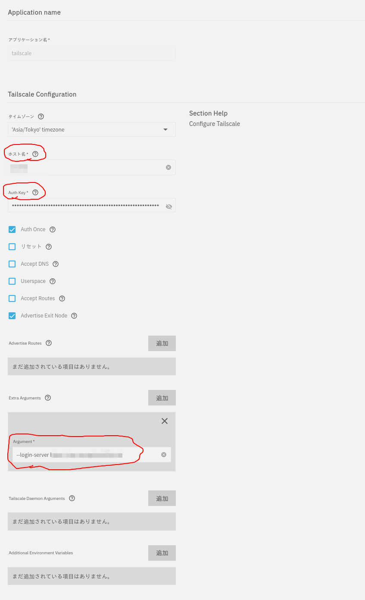

+++
date = '2026-08-11T15:58:10+09:00'
draft = false
title = 'headscaleを導入する'
+++

## VPNソリューション

これまで外から自宅ネットワークに繋ぐときには [WireGuard](https://www.wireguard.com/) を使っていた。
VPS上で動かす [linuxserver/wireguard](https://github.com/linuxserver/docker-wireguard) のコンテナを踏み台にするのだ。

しかし欠点が目立ってきたので、夏休みを機会にHeadscaleに置き換えることにした。以下にメモを残す。

## Headscale is

[Headscale](https://headscale.net/stable/) は [Tailscale](https://tailscale.com/) （のコントロールサーバー部分）の自由なライセンスによる互換実装である。
ちょうどVaultwardenとBitwardenの関係に近いと思えばよい。

Tailscale/Headscaleのwireguardに対するメリットとしては、メッシュネットワークの構築を基本とした仕組みが挙げられる。

WireGuardの場合は基本的にHub&Spokeの接続を行う。
Peerはそれぞれサーバーに接続し、サーバー経由でデータを交換するネットワークを構成する。

```mermaid
swimlane-beta BT
    subgraph Server
        server[WireGuard Server]
        title([WireGuardの場合])
    end

    subgraph Clients
        client_1[Client 1]
        client_2[Client 2]
        client_3[Client 3]
    end
    client_1 <-->|データ| server
    client_2 <-->|データ| server
    client_3 <-->|データ| server
```

この方法は構築しやすく管理しやすい反面、サーバーの帯域がボトルネックになってしまう欠点がある。
さくらVPSはインターネットアクセスの帯域が100Mbpsなので結構シビアな問題だ。

対して、Tailscale/Headscaleは基本的にメッシュネットワークでの接続を行う。
サーバーはクライアントの公開鍵とアドレスを交換する役割を担い、そのあとはクライアントどうしで接続する。

```mermaid
swimlane-beta BT
    subgraph Server
        title([Tailscale/Headscaleの場合])
        server[Tailscale/Headscale\nコントロールサーバー]
    end

    subgraph Clients
        
        client_1[Client 1]
        client_2[Client 2]
        client_3[Client 3]
    end

    client_1 & client_2 & client_3 <-->|接続情報| server

    client_1 <-->|データ| client_2
    client_2 <-->|データ| client_3
    client_3 <-->|データ| client_1
```

実際にはWireGuardでもメッシュネットワークを構築することは可能だし、Tailscale/Headscaleもベース部分にはWireGuard（やそのGo実装である [wireguard-go](https://github.com/WireGuard/wireguard-go) ）を使用している。
WireGuardに対するTailscale/Headscaleのメリットはスケーラビリティだ。
WireGuardでメッシュネットワークを構築する場合にhsクライアントが増えるたびに証明書やIPアドレスを相互に交換する必要がある。
このコストはO(N^2)で増えるため、大きなネットワークになるほど管理が困難となる。
Tailscale/Headscaleではコントロールサーバーで接続情報を集中管理することで、コストの増加をO(N)にとどめている。

## サーバー側のセットアップ

### インストール

[Official releases - Headscale](https://headscale.net/stable/setup/install/official/) に従えばよい。

私はサーバーにDebianを使っているのでdebパッケージを使った。
なお、aptのリポジトリを追加するわけではないので `apt-get` での自動更新はできない。
新しいバージョンがリリースされるたびに手動で更新する必要があるので、 GitHubで [Headscaleのリポジトリ](https://github.com/juanfont/headscale) をWatchに登録しておくことをお勧めする。


```sh
# ダウンロードしてインストール
wget https://github.com/juanfont/headscale/releases/download/v0.29.3/headscale_0.29.3_linux_amd64.deb
sudo dpkg -i headscale_0.29.3_linux_amd64.deb
```

### 設定

サーバーを動かす前に `/etc/headscale/config.yaml` を編集する。
サーバーを `nginx` の後ろで動かすのであればドメインだけ設定すればいい。

```yml{filename="/etc/headscale/config.yaml"}
# ドメイン
server_name: https://my-domain.examle.com
```

`nginx` の設定は [Reverse proxy - Headscale](https://headscale.net/stable/ref/integration/reverse-proxy/#nginx) を参考にして作成し、 `certbot` で証明書を発行しておく。

### 起動・常駐

`systemd` のユニットファイルが同梱されているのでサービスを動かすだけでOK。

```sh
sudo systemctl restart headscale
# 常駐するようになってるはずだがそうでなければ
sudo systemctl enable --now headscale
```

### ユーザー登録

Headscaleを利用するユーザーを登録する。
登録したらユーザーIDをメモしておく。
Headscaleではなぜか `--user` に指定するのがユーザー名だったりユーザーIDだったりするのだ。

```sh
# ユーザー登録
headscale users create MY_USER_NAME
# ユーザー情報の確認
headscale users list
ID | Name | Username     | Email | Created            
1  |      | MY_USER_NAME |       | 2026-08-10 01:23:45
```

## クライアント側

サーバーにクライアント（ドキュメント上の呼び名は「ノード」）を登録する方法は2種類ある。

- Web経由で対話的に登録する方法
- 事前認証鍵を使う方法

細かい手順は公式のドキュメントを読めばよいので、以下は公式ドキュメントに載っていない話。

### TrueNAS Scaleで使う

TrueNAS Scaleをクライアントとして登録する方法は以下のようになる。対話的なログインができないので事前認証鍵を使う。

1. サーバーで事前認証鍵を発行する。
```sh
# ここでは `--user` にIDを渡す
sudo headscale preauthkeys create --user ${USER_ID}
```
2. アプリで [Tailscale](https://apps.truenas.com/catalog/tailscale_community/) をインストールする
3. 設定をおこなう
   1. 「ホスト名」は適当に決める
   2. 「Auth Key」に事前認証鍵を貼り付ける
   3. 「Argument」に `--login-server https://headscale-url.example.com` の形でサーバーのURLを入力する



