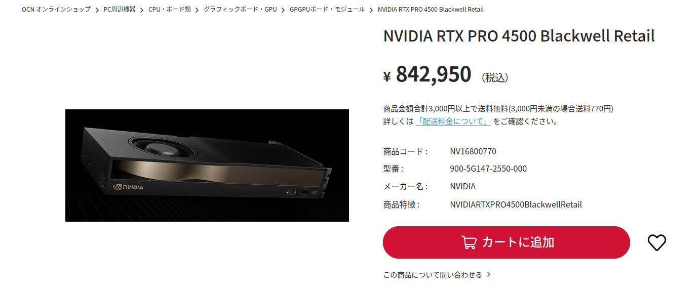
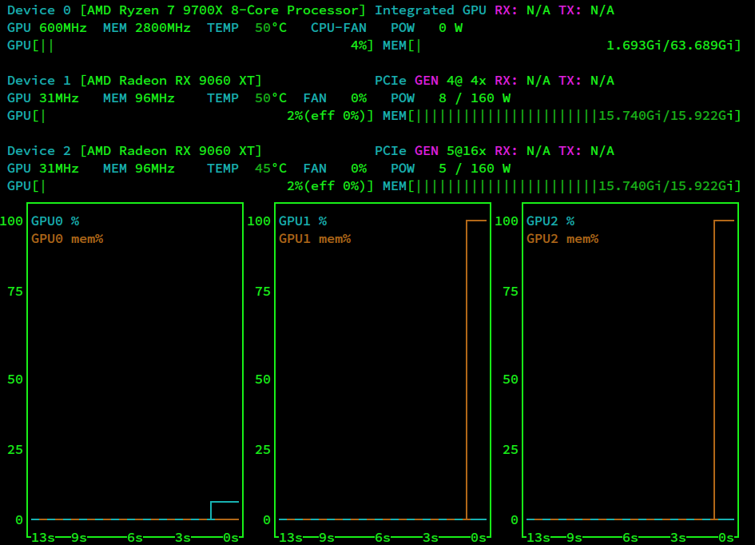
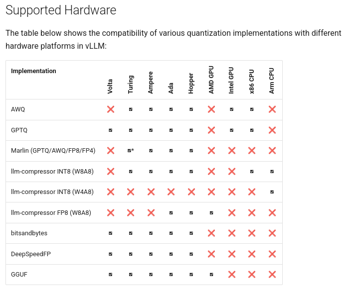
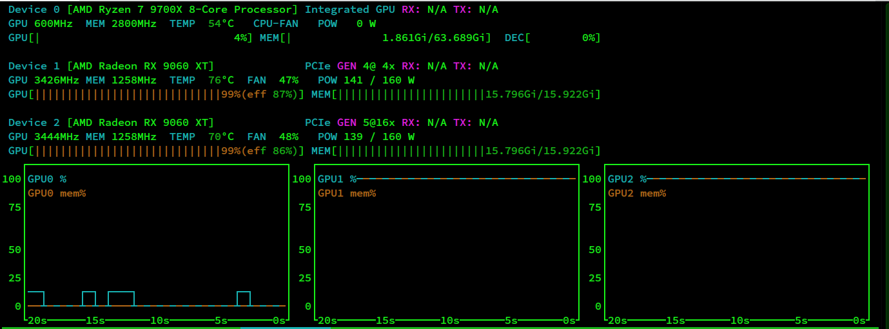

+++
date = '2026-09-16T21:44:54+09:00'
draft = false
title = 'GPU高騰時代のAIあそび'
+++

## 現在の状況

グラフィックボードの高騰が止まらない。Geforce RTX5090に至っては100万円が相場となっている。こんな時代になったのも全部AIベンダーとAIエヴァンジェリストが悪い。
そこで一消費者としてはAIベンダーの成果だけ吸い上げてAIベンダーに金も教師データも与えないという選択を取りたい。そう、ローカルAIだ。

以下はグラフィックボードが高くなった今を乗り切るためのGPU選びの話だ。

## モデルから考える要求事項

まずどんなモデルを使うかだ。2026年9月現在、ローカルで手軽に動かせる範囲で優秀なモデルはほぼ `gemma-4` ファミリーと `Qwen3.x` ファミリーで決まりだと思っている。具体的なモデルは以下のとおり。

- [google/gemma-4-31B-it](https://huggingface.co/google/gemma-4-31B-it)
- [google/gemma-4-26B-A4B-it](https://huggingface.co/google/gemma-4-26B-A4B-it)
- [Qwen/Qwen3.8-27B](https://huggingface.co/Qwen/Qwen3.8-27B )
- [Qwen/Qwen3.6-35B-A3B](https://huggingface.co/Qwen/Qwen3.6-35B-A3B)
- [Qwen/Qwen3.6-27B](https://huggingface.co/Qwen/Qwen3.6-27B)

次点で [meta-models/Muse-Glimmer-30B](https://huggingface.co/meta-models/Muse-Glimmer-30B) といったところだろうか。

概して30B規模のモデルがスイートスポットとなっている。これを4bit量子化した16GB前後をVRAMに収められるのが最低ラインであり、十分なコンテクストを確保するには24GB〜32GBのVRAMが必要だと思えばよい。さらに、生成速度で強い不満を感じないためには最低でも20tps程度を出したい。

## 安くあげるグラボの選び方（案）

### DGX Spark

タブを閉じるのは待ってほしい。話せばわかる。100万は超えるがVRAMの量だけが目当てであればRTX5090の4倍という驚異的なコスパだ。

欠点は所詮統合メモリであること。NVIDIAが本気で継続的なサポートを提供するかどうか不安があることだろうか。

### Ryzen AI Max+ 395 / 495搭載PC

DGX Sparkより安く統合メモリ128GBを求めるのであればこちら。ただし所詮は統合メモリの帯域にiGPUの性能なので性能には限度がある。

### NVIDIA RTX Pro 4500 Blackwell

タブを閉じるのは待ってほしい。本気だ。

VRAM32GBを搭載した業務向けカードにして、なんとRTX 5090より安い。

[(NVIDIA RTX PRO 4500 Blackwell Retail: PC周辺機器 OCN オンラインショップ（旧NTT-X Store）](https://nttxstore.jp/shop/g/gNV16800770)



RTX 5090と比較すると消費電力も控えめとなっているため絶対的な性能では劣る。だが無茶なカツ入れをしていないぶんワットパフォーマンスの高さで上回る。RTX5090を選ぶくらいならこちらのほうが特だと思っている。

### Radeon AI Pro R9700

AMDの業務向けカード。RX9070XTのVRAMを2倍にしたようなものというか、RX9060XT 16GBの規模を2倍にしたものというか。

NVIDIAほどではないがジリジリ値上がりを続けていて、最安（[Goppaが取り扱うXFX製](https://www.goppa.jp/xfxforce/shop/rx-97xproaiy/)）もまもなく30万円になろうとしている。
それ以外のメーカーなら35万円くらいだろうか。それでもNVIDIAのカードに比べれば遥かに安い。

### Radeon RX9060XT x2

本命として紹介するのがRX9060XTを2枚刺しする方法だ。32GBのVRAMを手に入れつつ試行錯誤の楽しみも得られるもっともお手軽な手段である。

値上がりしたとはいえ、なんとか1枚7万円くらいで買える場合もあるので2枚で15万円。Radeon AI Pro R9700の半額程度で済む。

以下の話は、これが意外と実用的だというだけの内容である。

## まず、性能はどうなんだ

llama.cpp 0.4.0の `llama-bench` でベンチマークを行った。ハードウェアは以下のとおり。

|項目||
|---|---|
|マザーボード|MSI B850-GAMING-PLUS-WIFI|
|CPU|AMD Ryzen7 9700X|
|メモリ|DDR5-5600 128GB|
|GPU|AMD Radeon RX9060XT x2|

RX9060XTの仕様によりPCI-Expressのレーン数はx8まで、マザーボードの仕様により2枚目のGPUのレーン数はx4に制限される。
つまり1枚はx8、もう1枚はx4でリンクしている。

### Denseモデルの場合

まずはVRAMに乗り切らないと生成速度が出ないDenseモデルから。

- unsloth/gemma-4-31B-it-qat:UD-Q4_K_XL
- unsloth/Qwen3.8-27B:UD-Q4_K_XL
- unsloth/Muse-Glimmer-30B-UD-Q4_K_XL

```sh
 llama-bench -m gemma-4-31B-it-qat-UD-Q4_K_XL.gguf,Qwen3.8-27B-UD-Q4_K_XL.gguf,Muse-Glimmer-30B-UD-Q4_K_XL.gguf -dev ROCm0/ROCm1 -sm tensor
```

| model                          |       size |     params | backend    | ngl |     sm | dev          |            test |                  t/s |
| ------------------------------ | ---------: | ---------: | ---------- | --: | -----: | ------------ | --------------: | -------------------: |
| gemma4 31B Q4_0                |  16.09 GiB |    30.70 B | ROCm,Vulkan |  -1 | tensor | ROCm0/ROCm1  |           pp512 |        404.12 ± 0.43 |
| gemma4 31B Q4_0                |  16.09 GiB |    30.70 B | ROCm,Vulkan |  -1 | tensor | ROCm0/ROCm1  |           tg128 |         24.03 ± 0.02 |
| qwen35 27B Q4_K - Small        |  16.68 GiB |    27.32 B | ROCm,Vulkan |  -1 | tensor | ROCm0/ROCm1  |           pp512 |        407.46 ± 0.28 |
| qwen35 27B Q4_K - Small        |  16.68 GiB |    27.32 B | ROCm,Vulkan |  -1 | tensor | ROCm0/ROCm1  |           tg128 |         23.00 ± 0.02 |
| muse-glimmer 30B Q4_K - Medium |  14.78 GiB |    27.85 B | ROCm,Vulkan |  -1 | tensor | ROCm0/ROCm1  |           pp512 |        404.84 ± 0.07 |
| muse-glimmer 30B Q4_K - Medium |  14.78 GiB |    27.85 B | ROCm,Vulkan |  -1 | tensor | ROCm0/ROCm1  |           tg128 |         26.02 ± 0.04 |

ギリギリではあるが20tpsを超えるtg（text generation: テキスト生成）が可能である。

### MoEモデルの場合

VRAMにモデルが乗り切らないことによるデメリットが相対的に小さいMoEモデルではどうなるか。同様にllama-benchの結果である。

- unsloth/gemma-4-26B-A4B-it-qat:UD-Q4_K_XL
- unsloth/Qwen3.6-35B-A3B:UD-Q4_K_XL

```sh
llama-bench -m gemma-4-26B-A4B-it-qat-UD-Q4_K_XL.gguf,Qwen3.6-35B-A3B-UD-Q4_K_XL.gguf -dev ROCm0/ROCm1 -sm layer
```

| model                          |       size |     params | backend    | ngl |     sm | dev          |            test |                  t/s |
| ------------------------------ | ---------: | ---------: | ---------- | --: | -----: | ------------ | --------------: | -------------------: |
| gemma4 26B.A4B Q4_0            |  13.26 GiB |    25.23 B | ROCm,Vulkan |  -1 |  layer | ROCm0/ROCm1  |           pp512 |      2251.67 ± 24.71 |
| gemma4 26B.A4B Q4_0            |  13.26 GiB |    25.23 B | ROCm,Vulkan |  -1 |  layer | ROCm0/ROCm1  |           tg128 |         62.83 ± 0.49 |
| qwen35moe 35B.A3B Q4_K - Medium |  20.81 GiB |    34.66 B | ROCm,Vulkan |  -1 |  layer | ROCm0/ROCm1  |           pp512 |      1667.53 ± 26.27 |
| qwen35moe 35B.A3B Q4_K - Medium |  20.81 GiB |    34.66 B | ROCm,Vulkan |  -1 |  layer | ROCm0/ROCm1  |           tg128 |         46.44 ± 0.22 |

tgで軽く40tpsや60tpsが出る。これは十分実用可能といっていいだろう。


## コンテクストはどのくらいまで伸ばせるんだ

`unsloth/gemma-4-31B-it-qat-GGUF` の場合、mmproj（`BF16`）まで読み込むと `--ctx-size 80000` くらいが上限となる。これ以上欲張ると画像を読み込ませたときに落ちる。

```sh
llama-server -m gemma-4-31B-it-qat-UD-Q4_K_XL.gguf  -dev ROCm0,ROCm1 -sm tensor  --mmproj ../mmproj/gemma-4-31B-it-qat-mmproj-BF16.gguf --ctx-size 82000
```

マルチモーダルをあきらめれば `--ctx-size 131072` まで確認している。GPU2枚とも __15.740GiB / 15.922GiB__ というVRAM使用量になるため、これがほぼ上限とみてよいと思う。

```sh
llama-server -m gemma-4-31B-it-qat-UD-Q4_K_XL.gguf  -dev ROCm0,ROCm1 -sm tensor   --ctx-size 131072
```



## 制限はないのか

llama.cppに関するかぎり、あまり制限はないと思ってよい。

vLLMを使う場合はROCmでは読み込めるフォーマットがかなり限られる。vLLMによるGGUFのサポートはまだexperimentalなので、実質的に使えるのはllm-compressor FP8のみである。



[Quantization - vLLM](https://docs.vllm.ai/en/stable/features/quantization/)


## まとめ

今ならまだ手の届く値段で手に入る、急げ。

GPUが100%ロードになっているのを見るのは楽しいぞ。



## おまけ

実は上記のDenseモデルの場合とMoEモデルの場合では設定が少し違う。具体的には `-sm` （split mode: レイヤー分割）の設定が違う。

以下に `llama-bench` の結果の全体を載せておく。

```sh
 llama-bench -m gemma-4-31B-it-qat-UD-Q4_K_XL.gguf,Qwen3.8-27B-UD-Q4_K_XL.gguf,Muse-Glimmer-30B-UD-Q4_K_XL.gguf,gemma-4-26B-A4B-it-qat-UD-Q4_K_XL.gguf,Qwen3.6-35B-A3B-UD-Q4_K_XL.gguf -dev ROCm0/ROCm1 -sm layer,tensor
```
| model                          |       size |     params | backend    | ngl |     sm | dev          |            test |                  t/s |
| ------------------------------ | ---------: | ---------: | ---------- | --: | -----: | ------------ | --------------: | -------------------: |
| gemma4 31B Q4_0                |  16.09 GiB |    30.70 B | ROCm,Vulkan |  -1 |  layer | ROCm0/ROCm1  |           pp512 |        622.49 ± 1.23 |
| gemma4 31B Q4_0                |  16.09 GiB |    30.70 B | ROCm,Vulkan |  -1 |  layer | ROCm0/ROCm1  |           tg128 |         15.72 ± 0.00 |
| gemma4 31B Q4_0                |  16.09 GiB |    30.70 B | ROCm,Vulkan |  -1 | tensor | ROCm0/ROCm1  |           pp512 |        404.12 ± 0.43 |
| gemma4 31B Q4_0                |  16.09 GiB |    30.70 B | ROCm,Vulkan |  -1 | tensor | ROCm0/ROCm1  |           tg128 |         24.03 ± 0.02 |
| qwen35 27B Q4_K - Small        |  16.68 GiB |    27.32 B | ROCm,Vulkan |  -1 |  layer | ROCm0/ROCm1  |           pp512 |        633.98 ± 2.89 |
| qwen35 27B Q4_K - Small        |  16.68 GiB |    27.32 B | ROCm,Vulkan |  -1 |  layer | ROCm0/ROCm1  |           tg128 |         14.80 ± 0.01 |
| qwen35 27B Q4_K - Small        |  16.68 GiB |    27.32 B | ROCm,Vulkan |  -1 | tensor | ROCm0/ROCm1  |           pp512 |        407.46 ± 0.28 |
| qwen35 27B Q4_K - Small        |  16.68 GiB |    27.32 B | ROCm,Vulkan |  -1 | tensor | ROCm0/ROCm1  |           tg128 |         23.00 ± 0.02 |
| muse-glimmer 30B Q4_K - Medium |  14.78 GiB |    27.85 B | ROCm,Vulkan |  -1 |  layer | ROCm0/ROCm1  |           pp512 |        717.87 ± 2.23 |
| muse-glimmer 30B Q4_K - Medium |  14.78 GiB |    27.85 B | ROCm,Vulkan |  -1 |  layer | ROCm0/ROCm1  |           tg128 |         17.31 ± 0.00 |
| muse-glimmer 30B Q4_K - Medium |  14.78 GiB |    27.85 B | ROCm,Vulkan |  -1 | tensor | ROCm0/ROCm1  |           pp512 |        404.84 ± 0.07 |
| muse-glimmer 30B Q4_K - Medium |  14.78 GiB |    27.85 B | ROCm,Vulkan |  -1 | tensor | ROCm0/ROCm1  |           tg128 |         26.02 ± 0.04 |
| gemma4 26B.A4B Q4_0            |  13.26 GiB |    25.23 B | ROCm,Vulkan |  -1 |  layer | ROCm0/ROCm1  |           pp512 |      2251.67 ± 24.71 |
| gemma4 26B.A4B Q4_0            |  13.26 GiB |    25.23 B | ROCm,Vulkan |  -1 |  layer | ROCm0/ROCm1  |           tg128 |         62.83 ± 0.49 |
| gemma4 26B.A4B Q4_0            |  13.26 GiB |    25.23 B | ROCm,Vulkan |  -1 | tensor | ROCm0/ROCm1  |           pp512 |       1090.19 ± 5.03 |
| gemma4 26B.A4B Q4_0            |  13.26 GiB |    25.23 B | ROCm,Vulkan |  -1 | tensor | ROCm0/ROCm1  |           tg128 |         60.55 ± 0.20 |
| qwen35moe 35B.A3B Q4_K - Medium |  20.81 GiB |    34.66 B | ROCm,Vulkan |  -1 |  layer | ROCm0/ROCm1  |           pp512 |      1667.53 ± 26.27 |
| qwen35moe 35B.A3B Q4_K - Medium |  20.81 GiB |    34.66 B | ROCm,Vulkan |  -1 |  layer | ROCm0/ROCm1  |           tg128 |         46.44 ± 0.22 |
| qwen35moe 35B.A3B Q4_K - Medium |  20.81 GiB |    34.66 B | ROCm,Vulkan |  -1 | tensor | ROCm0/ROCm1  |           pp512 |       1328.81 ± 4.14 |
| qwen35moe 35B.A3B Q4_K - Medium |  20.81 GiB |    34.66 B | ROCm,Vulkan |  -1 | tensor | ROCm0/ROCm1  |           tg128 |         51.22 ± 0.13 |


実際のところpp（prompt processing: プロンプト処理）は一貫して `sm=layer` のほうが高速である。
とはいえ、もともと処理時間におけるプロンプト処理の占める割合は小さいので、テキスト生成の速度を重視してよいと思う。

tg（text generation: テキスト生成）はモデルの種類によって `sm` の効果が異なる。
Denseモデルでは一定の効果がみられ、 `sm=tensor` のほうが `sm=layer` にくらべて1.5倍程度高速になる。
対してMoEモデルでは `sm=tensor` にしてもほとんど効果がないか、 `sm=layer` より遅くなることもある。

理由としては計算力とPCI-Expressの帯域のどちらが律速になっているかが違うためだろうと予想している。
`sm=tensor` は複数のGPUで同時に1つのレイヤーの計算を行うため計算力をフルに活用できるが、GPU間でのデータの交換が増える。
そしてPCI-ExpressはVRAMにくらべると大幅に遅い。さらにいえば今回は遅い側でリンクしているx4に制限される。

ここで、MoEは一度に必要になるパラメータをExpertとして小さく絞ることで計算の負荷を下げる仕組みである。
計算力は比較的少なくてよいにもかかわらずGPU間のデータ転送がDenseモデルと同様に必要だと仮定すると、低速なPCI-Expressがボトルネックになって性能が上がらないという状況になるのではないだろうか。

__Denseモデルではsm=tensor__ を __MoEモデルではsm=layer__ を選ぶのがよさそうだと考えておきたい。


