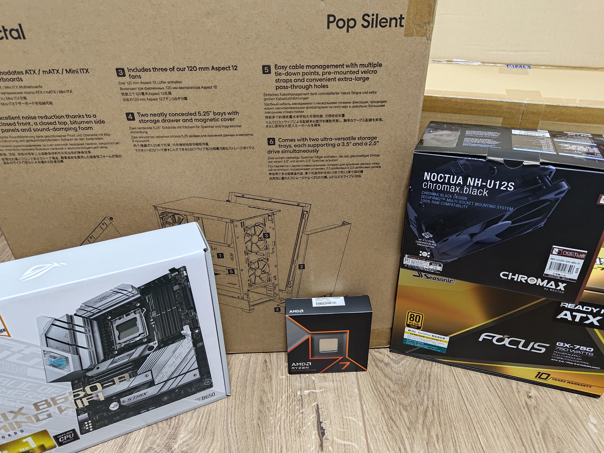
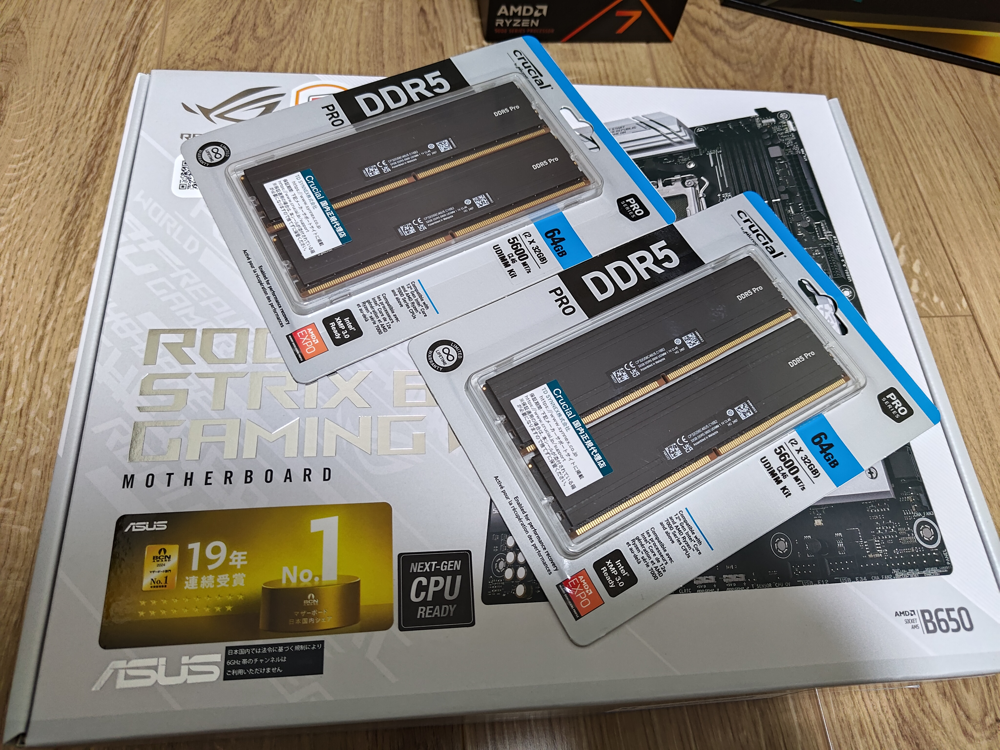
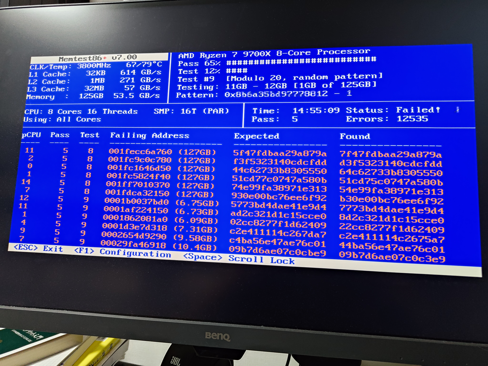
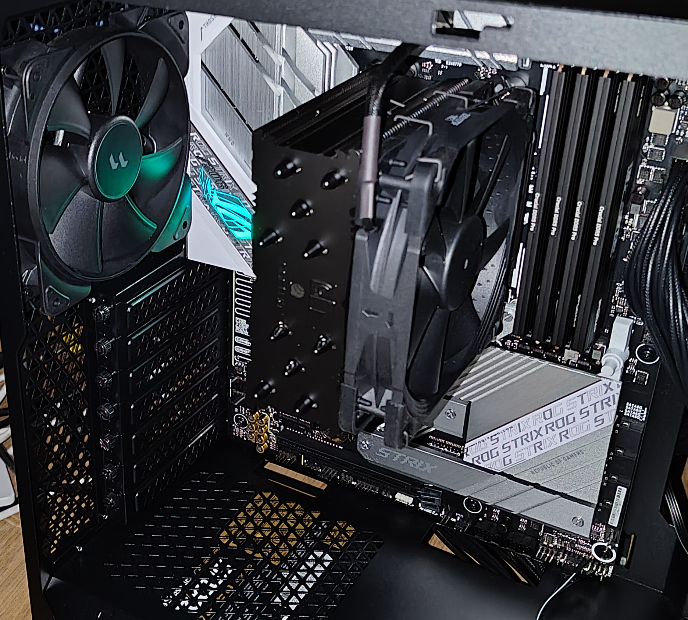

+++
draft = false
title = '2024年8月PC更新'
+++

# 2024年8月PC更新

組んでからだいぶ時間が経ってしまったがPCを更新した。

## 計画

Zen5が出るのにあわせて組む（以上）。Alderlakeの性能に不満はなかったが、AVX512を使ってみたい場面があったためAMDに乗り換えることにした。

前回（[2022年1月デスクトップPC更新](https://boronology.github.io/documents/desktop_pc_2022_1)）が大幅更新だったので今回は控えめな変更とし、ストレージは使い回す。

となるとCPUがRyzen 9700Xのほかはメモリを128GB積むくらいしか予定することはない。

## 買う

CPUを発売日に買うとして、マザーボード・メモリ・ケースは事前に準備しておく。

### 前日

発売日前日、「入荷数は少なめ」との報を受けて早朝から並ぶことを心に決める。

[Zen 5採用の最新CPU「Ryzen 7 9700X」がアキバに入荷。明日10日（土）より発売開始 - エルミタージュ秋葉原](https://www.gdm.or.jp/crew/2024/0809/550502)

整理券配布情報を集め、朝からツクモに向かう計画を立てた。

[Xユーザーのツクモパソコン本店さん: 「【8/10販売解禁🎊】 明日8月10日11時より発売となります期待の新CPU 『Ryzen7 9700X』8コア/16スレッド🎉 税込70,800円 『Ryzen5 9600X』6コア/12スレッド🎉 税込54,800円 当店店頭にて朝9時45分より整理券配布となります またRyzen 9000シリーズをご購入にて 先着でAMDノベルティもプレゼント！🎁 https://t.co/9G5CrnwA9W」 / X](https://x.com/TSUKUMO_HONTEN/status/1821879098479722553)

### 当日

朝から秋葉原に行ったが誰も並んでいない。強いて言えばakahana氏が同じ店で整理券を取っていたが、その時点で並んでいる人数は2名ぽっちだったという。

整理券を受け取るついでに店員に訊いてみると、ゲーマーは遠からず発売されるX3Dシリーズを待つため今回は様子見をしているだろうとのこと。早起きして損だったかもしれない。

### 結果

|              | メーカー       |                                                                                                                    | コメント   |
| ------------ | -------------- | ------------------------------------------------------------------------------------------------------------------ | ---------- |
| CPU          | AMD            | Ryzen 9700X                                                                                                        |            |
| マザーボード | ASUS           | [ROG STRIX B650-A GAMING WiFi](https://rog.asus.com/jp/motherboards/rog-strix/rog-strix-b650-a-gaming-wifi-model/) |            |
| メモリ       | Crucial        | DDR5-5600 32GBx4                                                                                                   | ※          |
| CPUクーラー  | Noctua         | NH-U12S chromax.black                                                                                              |            |
| ケース       | Fractal design | Pop Silent Solid Black                                                                                             | 前回と同じ |
| 電源         | Seasonic       | GX-750                                                                                                             |            |
| SSD          | Crucial        | P5 Plus 1TB                                                                                                        | 流用       |

メモリにはちょっと説明が必要だろう。知られているとおりDDR5では4枚挿すと速度に制限がかかり3600MHzが定格となるのでDDR5-5600で4枚買うのはオーバースペックなはずだ。しかしあえて買ったのにはちょっとした目論見があった。いわくXMPやEXPOを使うと定格で回ることが多いという噂なので、ちょっと欲張ってもいいだろうと思ったのだ。だがこれはあとで面倒を起こすことになる。

## 組む

特に難しいことはなく組み終わる。ストレージをそのまま持ってきたのでOSのインストールもなし。

## 動かす

初回起動時は10分近く待たされるが、何事もなく起動。やったね。

### メモリのオーバークロック

EXPOを適用して

ｱｱｱｱｱｱｱｱｱｱｱ

夢は潰えた。

## その他トラブル

### 眩しい

マザーボードの電飾が眩しい。PC背面から漏れる光だけで常夜灯になるレベル。

BIOSから無効化する。

### 突然死

使っていると突然のクラッシュが相次いだ。

状況は以下のようにわかるような、わからないような条件である。

- （確実）サスペンドすると復帰できなくなる
- （ランダム）使っていると突然画面が暗転し無反応になる

調査をしようとしたが、何もデータが残っていない。

- dmesgになにも残らない
- クラッシュ直前のログも別になにもない
- Magic SysRqも通らない
- そもそもキーボードが無反応

どうもマザーボード側が怪しい。調べてみるとオンボードのWiFi/Bluetoothが悪さをしているらしい事例が見つかる。

- [219290 – AMD Ryzen 7900x freeze when resuming from sleep with 6.11](https://bugzilla.kernel.org/show_bug.cgi?id=219290)

BIOSからWiFiとBluetoothを両方とも無効化するとクラッシュはしなくなった。なおWiFiだけ無効化した場合は引き続きクラッシュしていたことを添えておく。

## まとめ

円ドル相場のせいで予想より高くなってしまったが悪くないPCになった。

あとは適当なグラボを見つけて仮想マシンでS.T.A.L.K.E.R.2をプレイするだけだ。
