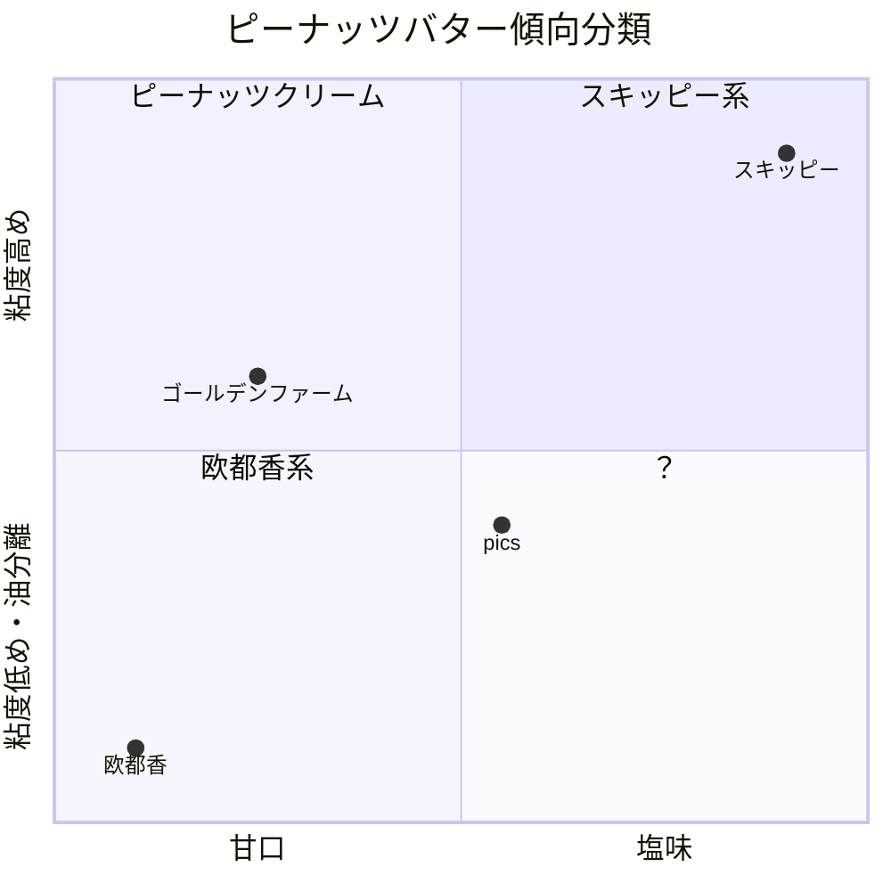

+++
date = '2026-02-13T06:57:51+09:00'
draft = false
title = 'ピーナッツバター比較'
+++

## ピーナッツバター

私はピーナッツバターが好きだ。パンやクラッカーに塗ってもいいが、おやつがないときにもスプーンで掬ってそのままぺろりと舐めるくらいには好きだ。

子供の頃からずっとスキッピーのピーナッツバターを使っていたが、最近になって他の製品にも手を広げているのでメモしていく。

## スキッピー

[SKIPPY® ピーナッツバター｜90年愛されてるピーナッツバター](https://www.peanutbutter.jpn.com/)

おおよそどこのスーパーでも手に入るド定番。以下のメモは主にスキッピーと比較しての感想となる。

## 明治屋

[【明治屋】スーパーマーケット｜商品情報｜商品情報一覧｜ジャム・スプレッド｜ピーナッツバター](https://www.meidi-ya.co.jp/goods/food/jam/peanut.html)

多くのスーパーマーケットで見るので、おそらくスキッピーの次くらいに入手しやすい。「クリーミー」も「クランチー」もある。

- 油が分離しないタイプ
- 粘度が高く、垂れることはない
- 甘みや塩気がしっかり効いていて、そのまま食べられる味
- クリーミーもクランチーも総じてスキッピーに近い

## ジェイビーズファクトリー

[ジェイビーズファクトリー　ピーナッツバター　クランチー　320g - カルディコーヒーファーム オンラインストア](https://www.kaldi.co.jp/ec/pro/disp/1/4580781732384)

カルディのような輸入食料品店で売っていることが多い。「クランチー」と「クリーミー」がある。以下はクランチーのメモ。

- 油が分離しないタイプ
- 粘度が高く、垂れることはない
- 甘みや塩気がしっかり効いていて、そのまま食べられる味
- スキッピーに近い

明治屋と同じじゃないかと言われるかもしれないが、私の貧乏舌では同じカテゴリに入ってしまうので仕方がない。

## pics

[ピックスピーナッツバター Pic's Peanut Butter ニュージーランドの無添加ピーナッツバター](https://www.picspeanutbutter.jp/)

ベトナム国旗のような蓋だがニュージーランド製。ここでは「スムース」を試した。ほかに「クランチー」もある。

- 油が分離するタイプ
- 混ぜた状態での粘度は低く、スプーンから簡単に垂れる
- ピーナッツの味にわずかな塩味。原料に砂糖が入っていないため甘みはほとんどない。
  - 料理に使うとよいかもしれない

## 欧都香

[千葉県産の落花生・ピーナッツ ｜欧都香（おおつか）](https://www.rakkasei.co.jp/)

千葉県産のピーナッツを使った日本製のピーナッツバター。ここでは「ピーナッツバター 有糖」を試した。ほかに「無糖」もある。

- 油が分離するタイプ
- 粘度は低め
- クランチほどではないが、粒の残るざらざらとした食感
- かなり甘口
  - ピーナッツのジャムと認識したほうが近いかもしれない。

## ゴールデンファーム

[フジフードサービス](http://www.fujifood.co.jp/img/product/pdf/GF_PeanutButter_ol_s.pdf)

ベトナム国旗のような蓋ではないがベトナム製のピーナッツバター。今回は「クリーミー」を試したが「クランチー」もある。

- 油が分離しないタイプ
- 粘度はやや低いが垂れることはない。スキッピーを柔らかくした感じ。
- なめらかさはトップクラス
- 味付けは甘めでピーナッツの風味がやや強い
- ピーナッツバターというよりピーナッツクリーム寄りに感じる

## 体感

## その他・今後試してみたいもの

- HAPPY NUTS DAY
- アリサン
- 三育フーズ
- カンピー
- マミービオ
- Clearspring
