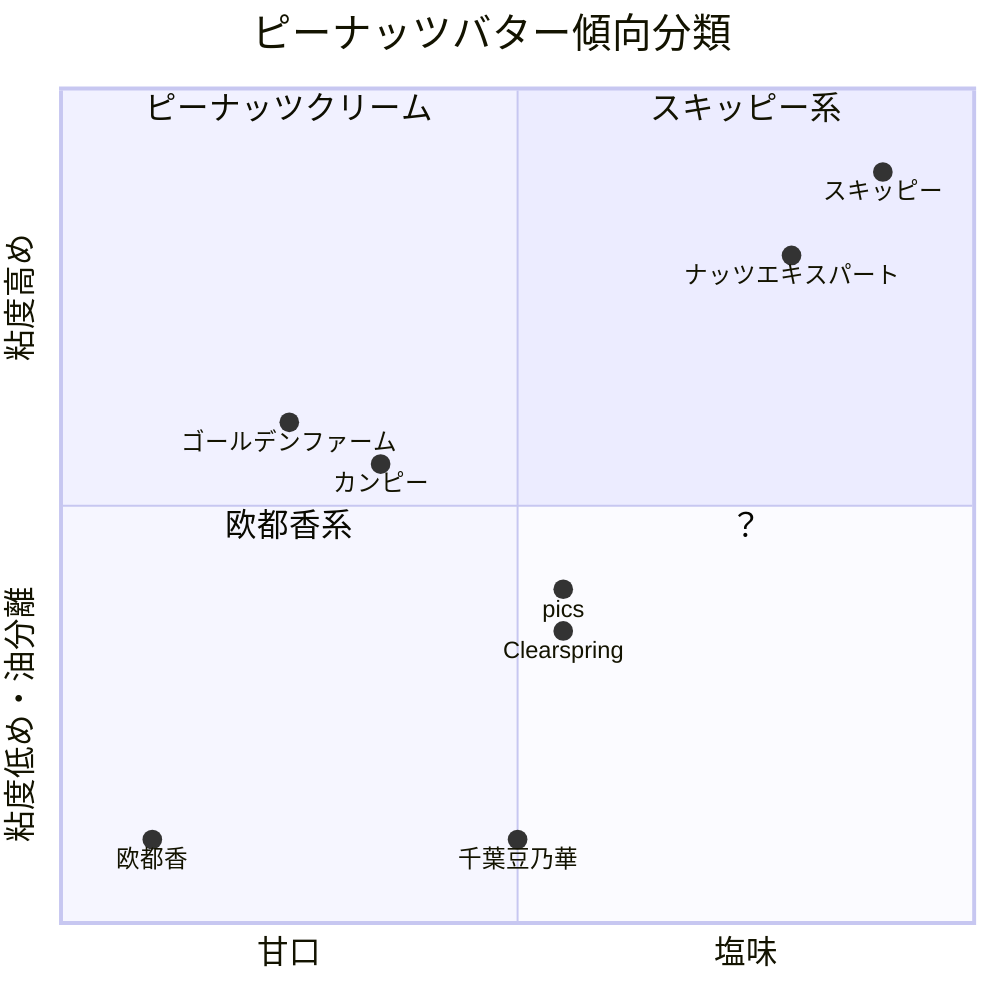

+++
date = '2026-02-13T06:57:51+09:00'
draft = false
title = 'ピーナッツバター比較'
+++

## ピーナッツバター

私はピーナッツバターが好きだ。パンやクラッカーに塗ってもいいが、おやつがないときにもスプーンで掬ってそのままぺろりと舐めるくらいには好きだ。

子供の頃からずっとスキッピーのピーナッツバターを使っていたが、最近になって他の製品にも手を広げているのでメモしていく。

## スキッピー

[SKIPPY® ピーナッツバター｜90年愛されてるピーナッツバター](https://www.peanutbutter.jpn.com/)

おおよそどこのスーパーでも手に入るド定番。以下のメモは主にスキッピーと比較しての感想となる。

## 明治屋

[【明治屋】スーパーマーケット｜商品情報｜商品情報一覧｜ジャム・スプレッド｜ピーナッツバター](https://www.meidi-ya.co.jp/goods/food/jam/peanut.html)

多くのスーパーマーケットで見るので、おそらくスキッピーの次くらいに入手しやすい。「クリーミー」も「クランチー」もある。原料のピーナッツは中国産。

- 油が分離しないタイプ
- 粘度が高く、垂れることはない
- 甘みや塩気がしっかり効いていて、そのまま食べられる味
- クリーミーもクランチーも総じてスキッピーに近い

## ジェイビーズファクトリー

[ジェイビーズファクトリー　ピーナッツバター　クランチー　320g - カルディコーヒーファーム オンラインストア](https://www.kaldi.co.jp/ec/pro/disp/1/4580781732384)

カルディのような輸入食料品店で売っていることが多い。「クランチー」と「クリーミー」がある。以下はクランチーのメモ。

- 油が分離しないタイプ
- 粘度が高く、垂れることはない
- 甘みや塩気がしっかり効いていて、そのまま食べられる味
- スキッピーに近い

明治屋と同じじゃないかと言われるかもしれないが、私の貧乏舌では同じカテゴリに入ってしまうので仕方がない。

## pics

[ピックスピーナッツバター Pic's Peanut Butter ニュージーランドの無添加ピーナッツバター](https://www.picspeanutbutter.jp/)

ベトナム国旗のような蓋だがニュージーランド製。ここでは「スムース」を試した。ほかに「クランチー」もある。

- 油が分離するタイプ
- 混ぜた状態での粘度は低く、スプーンから簡単に垂れる
- ピーナッツの味にわずかな塩味。原料に砂糖が入っていないため甘みはほとんどない。
  - 料理に使うとよいかもしれない

## 欧都香

[千葉県産の落花生・ピーナッツ ｜欧都香（おおつか）](https://www.rakkasei.co.jp/)

千葉県産のピーナッツを使った日本製のピーナッツバター。ここでは「ピーナッツバター 有糖」を試した。ほかに「無糖」もある。

- 油が分離するタイプ
- 粘度は低め
- クランチほどではないが、粒の残るざらざらとした食感
- かなり甘口
  - ピーナッツのジャムと認識したほうが近いかもしれない。

独特の味ではあるものの、これはこれでおいしい。おすすめ。

## ゴールデンファーム

[フジフードサービス](http://www.fujifood.co.jp/img/product/pdf/GF_PeanutButter_ol_s.pdf)

ベトナム国旗のような蓋ではないがベトナム製のピーナッツバター。今回は「クリーミー」を試したが「クランチー」もある。

- 油が分離しないタイプ
- 粘度はやや低いが垂れることはない。スキッピーを柔らかくした感じ。
- なめらかさはトップクラス
- 味付けは甘めでピーナッツの風味がやや強い
- ピーナッツバターというよりピーナッツクリーム寄りに感じる

苦いような妙な後味が残るので個人的にはイマイチ。

## ナッツエキスパート

成城石井で購入。フランス製。

[【公式】成城石井 - フランスより直輸入！食感のお好みでお選びください♪... | Facebook](https://www.facebook.com/seijoishii/posts/%E3%83%95%E3%83%A9%E3%83%B3%E3%82%B9%E3%82%88%E3%82%8A%E7%9B%B4%E8%BC%B8%E5%85%A5%E9%A3%9F%E6%84%9F%E3%81%AE%E3%81%8A%E5%A5%BD%E3%81%BF%E3%81%A7%E3%81%8A%E9%81%B8%E3%81%B3%E3%81%8F%E3%81%A0%E3%81%95%E3%81%84%E3%83%8A%E3%83%83%E3%83%84%E3%82%A8%E3%82%AD%E3%82%B9%E3%83%91%E3%83%BC%E3%83%88-%E3%83%94%E3%83%BC%E3%83%8A%E3%83%83%E3%83%84%E3%83%90%E3%82%BF%E3%83%BC-%E3%82%AF%E3%83%A9%E3%83%B3%E3%83%81%E3%82%AF%E3%83%AA%E3%83%BC%E3%83%9F%E3%83%BC%E5%90%84350g-%E7%A8%8E%E8%BE%BC%E5%90%84647%E5%86%86%E3%83%8A%E3%83%83%E3%83%84%E5%90%AB%E6%9C%89%E9%87%8F93%E3%81%A7%E3%83%94%E3%83%BC%E3%83%8A%E3%83%83%E3%83%84%E3%81%AE%E3%83%AD/1089897753351591/)

- 油が分離しないタイプ
- スキッピーより少し固め。常温で使うのがよい。
- 味付けはスキッピーよりやや控えめ

スキッピーほど派手ではない、控えめな味付けで食べやすい。おすすめ。

## 千葉豆乃華 ピーナッツペースト

商品名はピーナッツペーストとなっているので厳密にはピーナッツバター扱いしないほうがよいのかもしれない。千葉県産落花生100％。

[千葉豆乃華 - 株式会社川越屋 ｜ 落花生・豆菓子を丹精込めて暮らしのお届け](https://www.kawagoeya.com/?page_id=294)

- 油が分離するタイプ
- 舌触りはなめらか
- 食塩も砂糖も入っていないピーナッツのみの味
  - 塗って食べるならパンよりも塩気のあるビスケットが合うと思う。
- 料理には使いやすい

## カンピー

東武ストアで購入。

原材料が _ピーナッツバター（アルゼンチン製造）、砂糖、ショートニング、食用油脂、食塩_  となっているためピーナッツバターよりピーナッツクリームに近いかもしれない。ピーナッツバターの原料にピーナッツバターがあるのは段ボールを思わせる。

[ピーナッツバター クリーミータイプ （ロレーヌ岩塩使用） | 加藤産業株式会社](https://www.katosangyo.co.jp/product/detail/567/)

- 油は分離しない
- 舌触りはなめらか
- やや甘めでクリーミー。パンに塗って食べる前提の味。
- 全体に味付けはマイルド

ゴールデンファームと違ってこちらは後味に癖があるということもない。ピーナッツクリーム寄りの製品としておすすめ。

## Clearspring

通販で購入。原産国はオランダ。輸入は日仏貿易。今回は「スムース」を選択したが「クランチ」もある。

どうでもいいが日仏貿易の名前を見るのは「南の極み」（オーストラリアの塩）に続けて2回目だ。フランスから輸入してるものはないのだろうか？

[有機ピーナッツバター・スムース – 日仏貿易オンラインショップ](https://shop.nbkk.co.jp/products/s6-02)

- 油が分離するタイプ
- 塩味はかなり控えめで、おおよそpicsと同等
- 粘度はpicsより高めな印象

パンに塗るにも料理に使うにも便利な味付け。

## 体感

## その他・今後試してみたいもの

- HAPPY NUTS DAY
- アリサン
- 三育フーズ
- マミービオ
