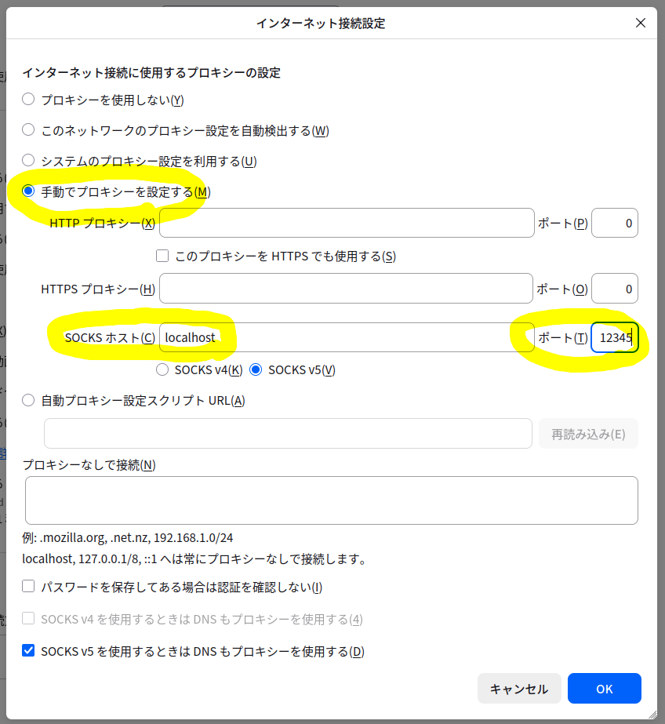

+++
date = '2026-01-14T13:25:32+09:00'
draft = false
title = 'セルフホストしたアプリケーションの初回セットアップ横取り問題'
+++

## 横取り問題 is

Webアプリケーションをセルフホストしてインターネットからアクセス可能にするとしよう。さらにそのアプリケーションは初回セットアップをWebブラウザ上で行うことになっているとしよう（PHP製のアプリケーションでよく見る気がする、NextCloudとか）。

するとこういうことが起こりうるはずだ。アプリケーションを起動し、ブラウザを開き、URLを入力してアプリケーションの初期セットアップ画面を開く。するとすでに見知らぬ誰かが初期セットアップを完了させている、ということが。

インターネットに公開した時点でURLは誰からでもアクセス可能なので、悪意のあるアクターが一足先にアクセスしてくる可能性は決して無いとはいえない。アプリケーションによっては内部でシェルを利用できる場合もあり、ひとたび発生すると深刻なセキュリティ上の問題になる。

## 対処案

たいていサーバーへのアクセスにはSSHを使っているはずだ。そのSSHをプロキシとして使用する方法がある。

OpenSSHはSOCKSプロトコルをサポートしている。そしてFirefoxなどのブラウザはSOCKSプロキシに対応している。そこで以下の手順をとることで、外部からアクセスできるようになる前にセットアップを実施する。

1. サーバーでは該当アプリケーションのポートを閉じておく
2. サーバー上で該当アプリケーションを起動する
3. クライアントからSSHでサーバーに接続する（後述）
4. ブラウザでSOCKSプロキシを使うよう設定する
5. ブラウザでサーバー上のアプリケーションにアクセスする
6. 初期セットアップを完了させる
7. アプリケーションのポートを開く

SSHは以下のコマンドを使用する。

```sh
# `-D port` でポートフォワーディングに使うポートを指定
ssh -D 12345 user@host
```

Firefoxであれば設定の「一般」→「ネットワーク設定」→「接続設定」で以下の設定を行う（Firefox v146時点）。



設定後は `http://{サーバーのIPアドレス}:{アプリケーションのポート}` でアクセスする。
