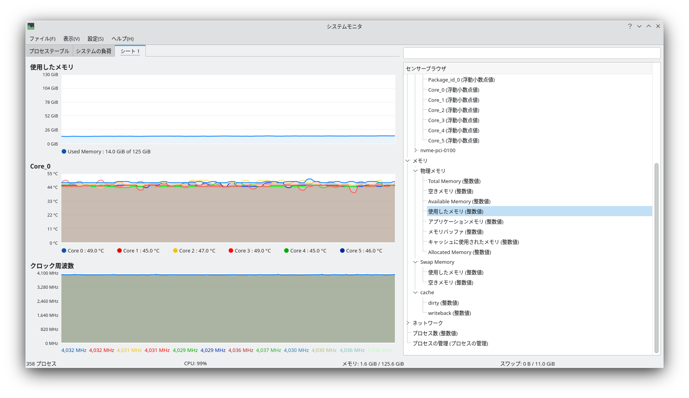
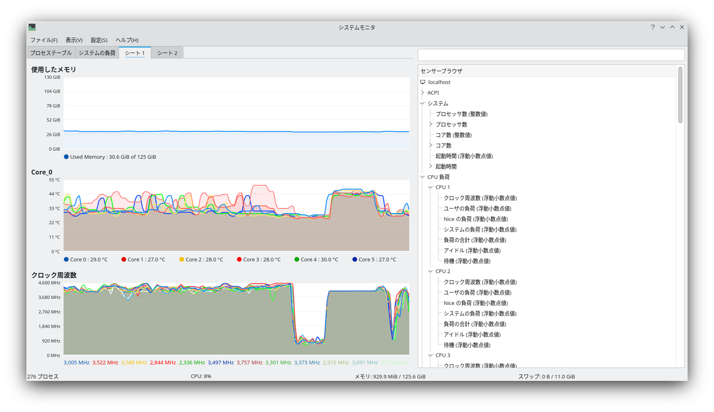

# 2022年PC更新計画

現在使っているPCは2018年にRyzen 2400Gで組んだもので、Windows11の動作環境からも外れるやや古いPCになってしまっている。インストールするのはArch LinuxなのだがVMでWindowsを動かしたいこともあるので新しいPCを調達することにした。

## 要件定義
求めることは以下のとおり。

* Windows11をVMで動かしたい
* 将来的にGPUパススルーも使いたい
* 普段遣いはLinux
* これまで使っていたパーツを流用してコストを下げたい
* 光らない

というわけで以下のようなスペックを検討する。

* CPU
  * 最新世代ならどれでもWindows11対応
  * Alderlakeの場合はEコアなしを選ぶ
    * Eコアありの場合KVMがどう動くのかよくわからない
  * iGPUありを選ぶ
    * GPUパススルーにそなえてホストが使うGPUが必要なため
* 大量のメモリ
  * VMを動かすためには多くて困ることはない
* PS/2端子がほしい
  * 初代Realforceをもうちょっと延命したい


## 選定結果
いったんWindows11 VMを後回しにし、ホスト側の環境だけ作ることにして以下のパーツを購入した。

||メーカー|商品名|数量|価格|
|---|---|---|---|---|
|CPU|Intel|[Core i5-12500](https://kakaku.com/item/K0001413993/)|1|29381|
|マザーボード|Asrock|[H670 PG Riptide](https://kakaku.com/item/K0001414054/)|1|21450|
|メモリ|Crucial|[CT2K32G4DFD832A （DDR4-3200 32GBx2 kit）](https://kakaku.com/item/K0001259108/)|2|54552|
|SSD|Crucial|[P5 Plus CT1000P5PSSD8JP （1TB）](https://kakaku.com/item/K0001374156/)|1|19939|
|CPUクーラー|noctua|[NH-U12A chromax.black](https://kakaku.com/item/K0001209730/)|1|16980|

合計14万ちょっと。

さらに以下のパーツを流用する。

||メーカー|商品名|コメント|
|---|---|---|---|
|電源|Seasonic|[PX-650](https://kakaku.com/item/K0001238307/)|予備として買い置きしていたセミファンレス電源|
|ケース|Silverstone|RV04|2代前のメインPCで使っていた倒立配置のフルタワーケース|

## 選定理由

### CPU
一番迷ったポイント。候補はこのとおり。

* Intel Alderlake
  * i5-12600
  * i5-12500
  * i5-12400
* AMD Cezanne
  * Ryzen7 5700G
  * Ryzen5 5600G

以下のように考えた結果、i5-12500が選ばれた。

||名前|理由|
|---|---|---|
||i5-12600|+200MHzが必要とは感じない|
|○|i5-12500|バランス|
||i5-12400|iGPUがUHD 740なのでUHD 770のi5-12500/12600に一段劣る|
||5700G|PCI-Expressが3.0しかなく足回りに不安がある|
||5600G|同上|

なお、もし登場していればi5-12500Tを選んでいた可能性が高い。2つ前のPCはIvy Bridgeでわざわざi5-3475Sを選んでいたので全く発想が変わっていない。

### メモリ
CPUで利用できる最大容量が128GBなので目一杯積む。

DDR5は高い、Alderlakeでは4枚挿すと速度制限がかかる、相性が厳しいなどの理由から選ばず、枯れたDDR4を使うことにした。メーカーは安心のCrucial。OCなどはしないので定格DDR4-3200でよい。

### マザーボード
OCはしないのでZ690チップを選ぶ必要はなかった。ケースは流用することにしたので拡張性を考えてmicro-ATXを外し、あとはPS/2があるものの中から選んだ。

### ストレージ
PCI-Express4.0のNVMeで1TBくらいのものを探す。当初はPlextor PX-1TM10PGNを考えていたが、SSDはNANDメーカー製に限るとアドバイスを受けて安定のCrucialに変更。

### CPUクーラー
一度noctuaを使ってみたかった（以上）。

LGA1700対応していれば久々にThermalrightを使おうとも思っていたが、残念ながらまだ対応部品が出ていない。

### 謝辞
[自作PC 構成見積もり てすと](http://niku.webcrow.jp/)には大変お世話になりました。この場を借りてお礼を申し上げます。


## 後日追加するパーツ

### ストレージ
VM用にもう1枚NVMe SSDを足す。

### GPU
Radeon RX6600XTあたりを追加する。はやく値下がりしてほしい。

### Windows
Windows10を買って、将来的に11にアップグレードする。

## 組む


というわけで組む。

### 組み付け
RV04はマザーボードのベースが取り外せるのでいったん外した状態でまな板にする。


### memtest
お約束のmemtest86を回す。


ここで重要な話だがメモリが128GBあると4passで20時間もかかる。昔のように10pass回しているとまる2日かかるはずだ。エラーなし。

### ケースに入れる
RV04はCPUクーラーを下から支えるサポーターがあるので重量級のU12Aでもマザーボードがたわむ心配はない。グラボも上から吊り下げるサポーターがあるので重量級を乗せても安心。そんな重量級のグラボを買う金があればの話だが。

ところでSilverstoneはそろそろ[TJ08-E](https://www.silverstonetek.com/product.php?pid=303&area=jp)や[RL08](https://www.silverstonetek.com/product.php?pid=862&area=jp)の大型版みたいな倒立ATXケース出してくれないかなぁ。

## インストール
ArchInstallBattleする。特に変わったことはやらない。

パーティションは */boot* とそれ以外の2つに分け、btrfsのサブボリュームを活用する。サブボリュームは定番の分け方+αにしてsnapperでスナップショットを管理することにする。btrfsの圧縮は最近のセオリー通りZstdを使う。

```
# nvme0n1p1
/boot

# nvme0n1p2
/               -> @
/home           -> @home
/.snapshots     -> @snapshots
/var/log        -> @var_log
/swap           -> @swap
```

*/swap* はスワップファイルの置き場所で、`compress=no`をつけてマウントする。

### スワップについて
メモリがいくら多くてもスワップは必要であるという（参考:[スワップの弁護：よくある誤解を解く](https://chrisdown.name/ja/2018/01/02/in-defence-of-swap.html)）。とはいえ古典的に「スワップはメモリの2倍」と言われてるがメモリ128GBでもそうなのか？SSDの4分の1を占拠する256GBのスワップパーティションが誕生するのか？と思って調べたところ、そうでもないことがわかる。

* [第15章 swap 領域 Red Hat Enterprise Linux 7 Red Hat Customer Portal](https://access.redhat.com/documentation/ja-jp/red_hat_enterprise_linux/7/html/storage_administration_guide/ch-swapspace)
  > |システム内の RAM の容量|推奨されるスワップ領域|ハイバネートを許可する場合に推奨されるスワップ領域|
  > |---|---|---|
  > |>64 GB	|最低 4GB	|ハイバネートは推奨されない|
* [SwapFaq - Community Help Wiki](https://help.ubuntu.com/community/SwapFaq)
  >        RAM   No hibernation    With Hibernation  Maximum
  >      128GB             11GB               139GB    256GB

ハイバーネートは使わないのでUbuntuの方針に従って11GBのスワップファイルを用意することにした。以下のようにスワップファイルを用意する（参考:[btrfsでswapfile + hibernation - Qiita](https://qiita.com/tmsn/items/41bf294728a4d2c0d4b8)）。

```sh
truncate -s 0 /swap/swapfile
chattr +C /swap/swapfile
fallocate -l 11G /swap/swapfile

mkswap /swap/swapfile
```

### Intel Graphicsについて
最近のIntel Graphicsを使う場合は`xf86-video-intel`を入れてはいけない。KDE Plasmaでは画面がちらついて操作できなくなった。ついうっかり入れがちだし（私は`xorg-drivers`で入れてしまった）昔は入れて当然だったので結構罠になりそう。

## 動作確認
新しいCPUを試すべくとりあえずカーネルをビルド。Processor familyをAlder lakeにした`linux-zen`を作る。当然ながら`-j12`で6C12Tを全部使う。




全コアが動くときは4GHzが上限らしい。とはいえこれだけ負荷をかけても50℃程度でおさまるのだから噂通りnoctuaの冷却は優秀だった。


並列化できないところに来ると負荷がかかるコアだけクロックが4GHzを超えるが、CPU全体での発熱はむしろ低下している。



*/etc/makepkg.conf* に */tmp*でビルドするよう指定しているのでビルドを進めるとメモリをもりもり消費する。でも余裕。

約20分でビルド完了。


## 追記
使っていると以下のようなUSB関連のトラブルが相次いだ。

* ときどきUSBデバイスの応答が悪くなる
  * サウンドデバイスなら音にノイズが乗る
  * マウスが止まる
* もっと悪くなるとxhci_hcdが固まる
  * USBが完全に使えなくなる
  * `rmmod xhci_pci && modprobe xhci_pci` すれば直るものの、しばらくすると再発する

ログの一例を挙げる。

> [152777.937048] xhci_hcd 0000:00:14.0: Frame ID 495 (reg 3968, index 5) beyond range (497, 1391)
> [152777.937049] xhci_hcd 0000:00:14.0: Ignore frame ID field, use SIA bit instead
> [152778.094058] xhci_hcd 0000:00:14.0: WARN Event TRB for slot 9 ep 9 with no TDs queued?

> 1月 31 13:50:12 hematite kernel: usb 1-7: reset low-speed USB device number 5 using xhci_hcd
> 1月 31 13:50:13 hematite kernel: usb 1-7: device not accepting address 5, error -108
> 1月 31 13:50:13 hematite kernel: usb 1-7: USB disconnect, device number 5


埒が明かないため2022年3月にマザーボードを交換した。交換先は[MSI MAG H670 TOMAHAWK WIFI DDR4](https://jp.msi.com/Motherboard/mag-h670-tomahawk-wifi-ddr4)にした。


### USBについて
交換後はこのような問題が一切起きなくなったのでひとまずよしとする。

H670 PG RiptideのオンボードUSBハブはUSBは色々と悪名高いASMedia製チップを使っていたため、根拠のない推測だがこれが原因の可能性を強く疑っている。どちらにしても当面ASRockは買わないことにした。

### MSIのUEFIとGRUB
マザーボード交換後はUEFIにブートエントリを登録する。

インストールメディアでブートしてマウントと`arch-chroot`したのち以下のコマンドを実行する。

```sh
grub-install --target=x86_64-efi --target-directory=/boot
```

これ自体はなんの問題もなく完了するが、再起動するとこのエントリが消滅する。`efibootmgr`で見てみると再起動前には表示されたエントリが再起動後（GRUBに入れないのでインストールメディアが起動するが）は跡形もなく消えている。

これを回避するためには[GRUB - ArchWiki](https://wiki.archlinux.org/title/GRUB#Default/fallback_boot_path)に従って`--removable`をつけて実行し、grubx64.efiの置き場所を変えてやればよい。

```sh
grub-install --target=x86_64-efi --target-directory=/boot --removable
```

この問題は一部でよく知られているらしく、[[SOLVED] Efi boot entry disappears after reboot. MSI BIOS E7B05IMS.1A0 / Installation / Arch Linux Forums](https://bbs.archlinux.org/viewtopic.php?id=250928)では

> MSI's are notorious for this 

とまで言われている。

たぶん悪意があってこのような動作にしているわけではなく

* UEFIが\EFI\${ENTRY}\GRUBX64.EFIを見ていない
* 起動時に有効なエントリが見つからなかったときはエントリをリセットする

の組み合わせでこのような問題が起きているのだろうと思う。