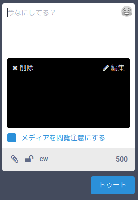
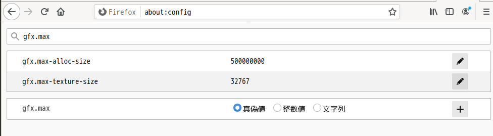

# 大きな画像を添付するとリサイズ結果が真っ黒になる問題の対処法

## 経緯
私のmastodonサーバーの利用者から、特定の画像の添付に失敗し、以下のような真っ黒な画像になってしまうという報告を受けたため調査をおこなった。



なおこの時点でのmastdonのバージョンはv3.2.0、Dockerで運用している。

また利用者の環境はWindows10 64bit、ブラウザはFirefox 81.0。添付しようとした画像は14174x10630px、14.6MB（正確には15273264Byte）だった。

## 結論
先にどのようにしたら直るかをまとめておく。

### 発生する条件
Firefoxで125000000ピクセル以上の画像を投稿しようとすると発生する。

### 原因
Firefoxのデフォルト設定におけるCanvasの上限に引っかかっていた。

### 対応
利用者のブラウザで *about:config* から `gfx.max-alloc-size`を上げてもらう。今回は面倒なので最大値（`2147483647` = 2^32-1）にしてもらった。
最低でも対象の画像の画素数の4倍になっている必要がある。

## 調査の記録
利用者から該当の画像を提供してもらい、調査を行った。

### 環境？
OS・ブラウザの可能性を考えて自分の環境でも試してみる。

|OS|ブラウザ|結果|
|---|---|---|
|Linux|Vivaldi 3.3.2022.47|発生しない|
|Linux|Chromium 85.0.4183.121|発生しない|
|Linux|Firefox 81.0|発生する|
|Linux|Firefox Developer Edition 82.0b5 |発生する|
|（参考・利用者）Windows|Firefox 81.0|発生する|

ここからFirefoxの問題と判断した。


### 画像リサイズの処理？
mastodonの画像リサイズの処理がブラウザ固有のバグを踏んでいるのではないか？と仮定してソースを確認する。

該当の処理は [app/javascript/mastodon/utils/resize_image.js](https://github.com/tootsuite/mastodon/blob/v3.2.0/app/javascript/mastodon/utils/resize_image.js) にある。

主要な処理は

```js
const processImage = (img, { width, height, orientation, type = 'image/png' }) => new Promise(resolve => {
  const canvas  = document.createElement('canvas');

  if (4 < orientation && orientation < 9) {
    canvas.width  = height;
    canvas.height = width;
  } else {
    canvas.width  = width;
    canvas.height = height;
  }

  const context = canvas.getContext('2d');

  switch (orientation) {
  case 2: context.transform(-1, 0, 0, 1, width, 0); break;
  case 3: context.transform(-1, 0, 0, -1, width, height); break;
  case 4: context.transform(1, 0, 0, -1, 0, height); break;
  case 5: context.transform(0, 1, 1, 0, 0, 0); break;
  case 6: context.transform(0, 1, -1, 0, height, 0); break;
  case 7: context.transform(0, -1, -1, 0, height, width); break;
  case 8: context.transform(0, -1, 1, 0, 0, width); break;
  }

  context.drawImage(img, 0, 0, width, height);

  // The Tor Browser and maybe other browsers may prevent reading from canvas
  // and return an all-white image instead. Assume reading failed if the resized
  // image is perfectly white.
  const imageData = context.getImageData(0, 0, width, height);
  if (imageData.data.every(value => value === 255)) {
    throw 'Failed to read from canvas';
  }

  canvas.toBlob(resolve, type);
});

const resizeImage = (img, type = 'image/png') => new Promise((resolve, reject) => {
  const { width, height } = img;

  const newWidth  = Math.round(Math.sqrt(MAX_IMAGE_PIXELS * (width / height)));
  const newHeight = Math.round(Math.sqrt(MAX_IMAGE_PIXELS * (height / width)));

  getOrientation(img, type)
    .then(orientation => processImage(img, {
      width: newWidth,
      height: newHeight,
      orientation,
      type,
    }))
    .then(resolve)
    .catch(reject);
});
```

にある。画像を指定したサイズの`Canvas`に描画して、結果をBlobとして取得するらしい。
この処理を動かす間にブラウザのコンソールに特に例外のログは出ていない。

しかし、この処理を切り出してデバッグを行っていたところ、

```js
const imageData = context.getImageData(0, 0, width, height);
```

の処理で

> [GFX1-]: Failed to allocate a surface due to invalid size (CDT) Size(14174,10630)

というメッセージがブラウザからエラー出力されているのが見つかった。Sizeを見るとどうやらFirefoxがアップロードされた画像を受け付けていないらしい。

### Firefoxの処理？
そういうわけでFirefoxの処理を調べる。ソースは [Index of /pub/firefox/releases/81.0/source/](https://archive.mozilla.org/pub/firefox/releases/81.0/source/) から落とした。

エラーメッセージをもとに発生場所をたどると *gfx/2d/Factory.cpp* が見つかる。

```cpp
already_AddRefed<DrawTarget> Factory::CreateDrawTarget(BackendType aBackend,
                                                       const IntSize& aSize,
                                                       SurfaceFormat aFormat) {
  if (!AllowedSurfaceSize(aSize)) {
    gfxCriticalError(LoggerOptionsBasedOnSize(aSize))
        << "Failed to allocate a surface due to invalid size (CDT) " << aSize;
    return nullptr;
  }
```

`AllowedSurfaceSize(aSize)`で描画対象のサイズをチェックし、範囲外のときにこのメッセージを出しているらしい。ではこの`AllowedSurfaceSize()`はというと

```cpp
bool Factory::AllowedSurfaceSize(const IntSize& aSize) {
  if (sConfig) {
    return Factory::CheckSurfaceSize(aSize, sConfig->mMaxTextureSize,
                                     sConfig->mMaxAllocSize);
  }

  return CheckSurfaceSize(aSize);
}
```

となっているので`CheckSurfaceSize()`を見る。

```cpp

bool Factory::CheckBufferSize(int32_t bufSize) {
  return !sConfig || bufSize < sConfig->mMaxAllocSize;
}
```

オーバーロードがあるので両方見てもいいのだが、どちらも`sConfig->mMaxAllocSize`と比較していることがわかるのでこれだけ見れば十分だろう。

`sConfig->mMaxAllocSize`をセットするところを探してみると *gfx/thebes/gfxPlatform.cpp* が見つかる。

```cpp
void gfxPlatform::InitMoz2DLogging() {
  auto fwd = new CrashStatsLogForwarder(
      CrashReporter::Annotation::GraphicsCriticalError);
  fwd->SetCircularBufferSize(StaticPrefs::gfx_logging_crash_length_AtStartup());

  mozilla::gfx::Config cfg;
  cfg.mLogForwarder = fwd;
  cfg.mMaxTextureSize = gfxPlatform::MaxTextureSize();
  cfg.mMaxAllocSize = gfxPlatform::MaxAllocSize();

  gfx::Factory::Init(cfg);
}

```

つまり

```cpp
/* static */
int32_t gfxPlatform::MaxAllocSize() {
  // Make sure we don't completely break rendering because of a typo in the
  // pref or whatnot.
  const int32_t kMinAllocPref = 10000000;
  return std::max(kMinAllocPref,
                  StaticPrefs::gfx_max_alloc_size_AtStartup_DoNotUseDirectly());
}
```

これで得ているのだが実体はこのコードではない。 *modules/libpref/init/StaticPrefList.yaml* にある

```yaml
# Use gfxPlatform::MaxAllocSize instead of the pref directly.
- name: gfx.max-alloc-size
  type: int32_t
  value: (int32_t)500000000
  mirror: once
  do_not_use_directly: true
```

のほうだろう。


### about:config？
コード中でなくyamlにあること、およびこの`name`になにか見覚えがあったのでFirefoxで *about:config* を開いてみる。



これをとりあえず最大値の`2147483647`にしてみると


これにて一件落着。


## 追加:gfx.max-alloc-sizeと画像サイズ
実際のところ`gfx.max-alloc-size`はいくつにすればいいのか？

いくらか試してみる。

|gfx.max-alloc-sizeの値|結果|
|---|---|
|500000000（デフォルト値）|NG|
|600000000|NG|
|602678480|NG|
|603000000|OK|
|610000000|OK|
|2147483647|OK|

今回の画像が14174x10630=150669620pxであったことを踏まえると、150669620x4=602678480が最低限必要なサイズかと思ったが、実際にはもう少し余裕が必要だった。

つまり**gfx.max-alloc-sizeは描画する画素数の4倍強必要**ということらしい。