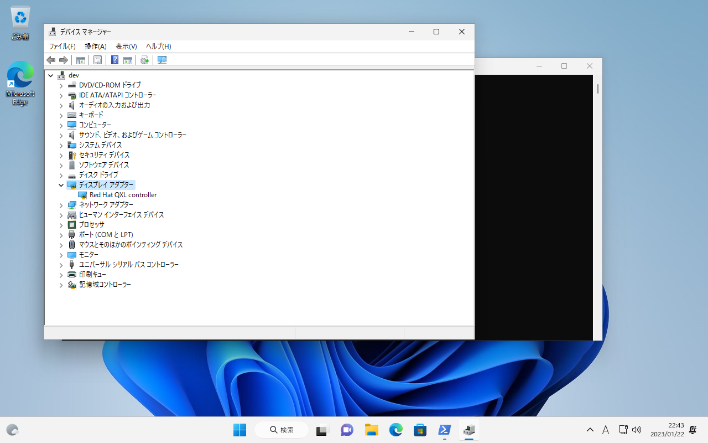
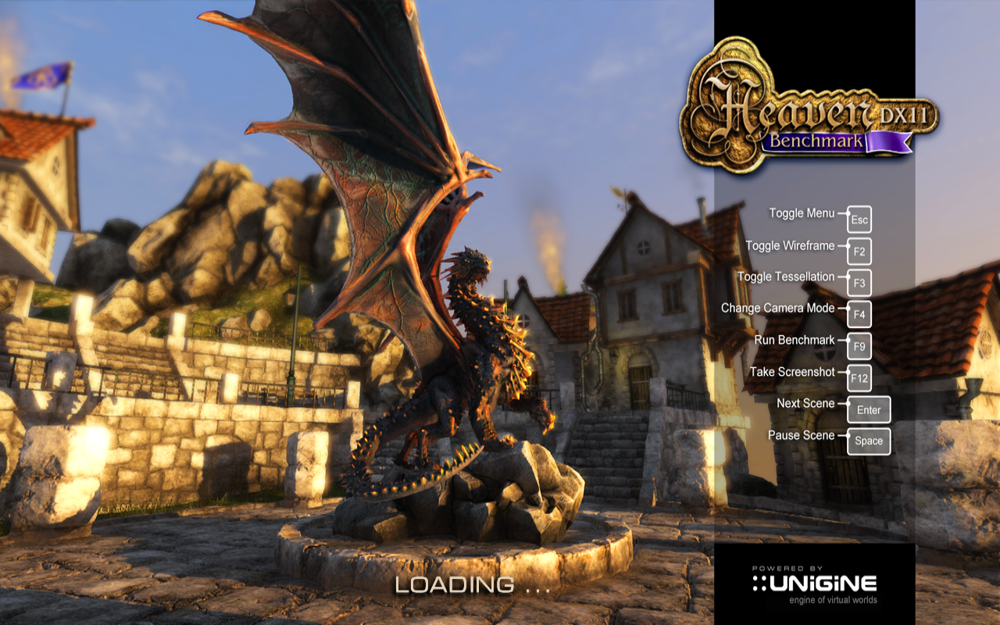
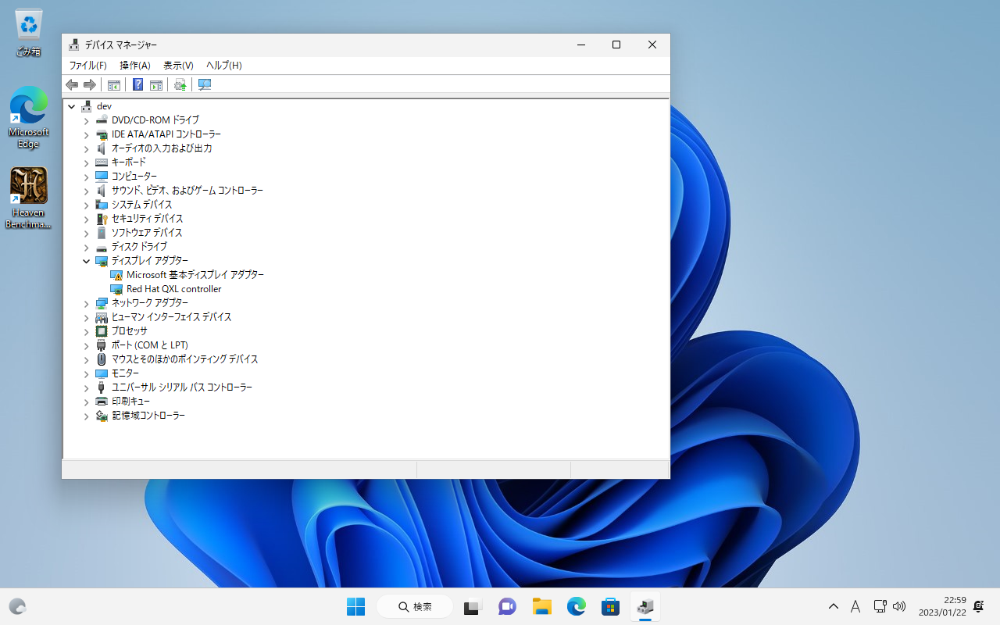
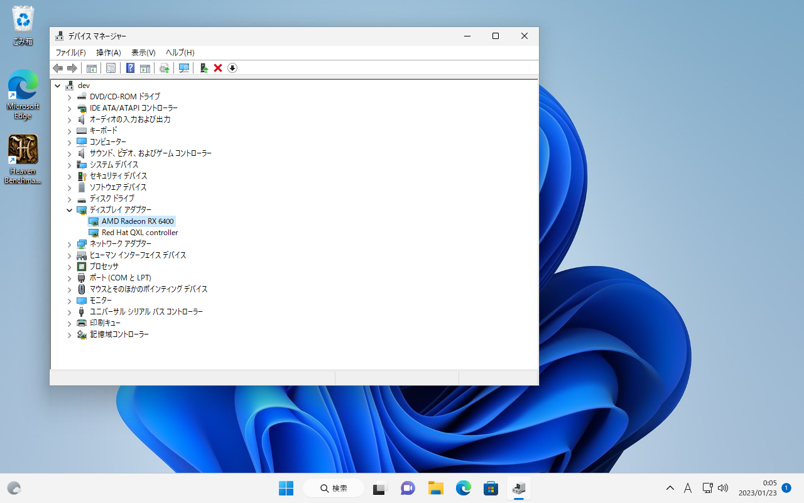
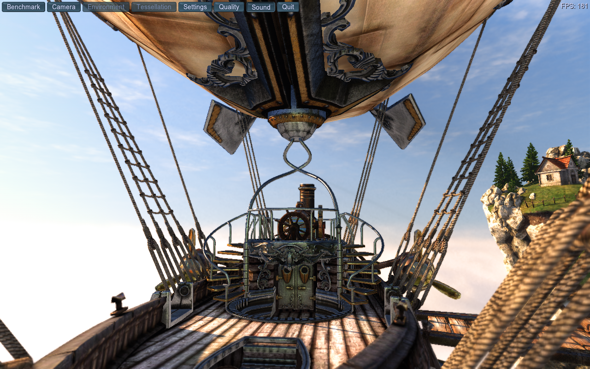

# Radeon RX6400を仮想マシンにパススルーする
QEMU/KVMのWindows11仮想マシンにRadeon RX6400をパススルーし、仮想マシン上でGPUを使う方法をまとめる。

## ユースケース
ゲストにGPUを渡してGPUの計算力を使用するが、画面出力自体はリモートデスクトップを用いる。この方法であればUSBデバイス（特に入力デバイス）の受け渡しを考慮しなくてよい。

この場合リモートデスクトップに使えるプロトコルはSpice、またはRDPとなる。SpiceはWindowsのエディションを選ばずに使える（HomeではRDP経由のアクセスは提供されていない）、USBのリダイレクトが容易、などのメリットがあるが、使える環境であればRDPはWindows組み込みだけあって安定している。時と場合によって使い分ければよい。

## 環境
基本的なハードウェアの組み合わせはIntel CPUのiGPU＋Radeon RX6400である。CPUがAMDの場合、GPUがNVIDIAやIntelの場合（あるいはそれ以外のベンダーの場合）には適宜読み替える必要がある。さらに、単に読み替えただけでは動作しない場合もある。

| ハードウェア | |
|---|---|
|CPU| Intel Core i5-12500|
|iGPU|Intel UHD Graphics 770|
|dGPU| AMD Radeon RX6400|

ディストリビューションはArch Linux。2023-01-24時点で最新の以下のパッケージを使った。

|ソフトウェア | バージョン|
|---|---|
|linux| 6.1.7.arch1-1|
|qemu|7.2.0-3|
|libvirt|1:9.0.0-1|
|virt-manager |4.1.0-1|
|edk2-ovmf|202211-3|


## 手順

### 1. 仮想マシン作成
先にGPUパススルーなしでVMを作り、Windowsをインストールする。今回使ったバージョンのvirt-managerではWindows11用のプロファイルが用意されているが、古いバージョンのvirt-managerを使ってWindows11ゲストを作るのであればWindows10のプロファイルをベースに以下の設定を行えばよい。

* 仮想マシンのファームウェアを **OVMF_CODE.fd** にする
* チップセットを **Q35** にする
* 「ハードウェアを追加」から **TPM** デバイスを追加する

パフォーマンスを求める場合はディスクをSATAからVirtIOにしたりNICをe1000からVirtIOにしたりしてもよいが、この記事では説明しない。

OSのインストールが終わったら [virtio windows driver](https://github.com/virtio-win/virtio-win-pkg-scripts/blob/master/README.md) を使い、デバイスマネージャーで警告の出ているデバイスにドライバを当てておく。この時点ではディスプレイアダプターとしては **Redhat QXL controller** のみが表示されている。



当然、3Dグラフィックスはまともに動作しない。



### 2. 共通手順
ホストのIOMMUを有効化する。本環境はIntelプロセッサのため、ブートローダーの設定でカーネルパラメータに `intel_iommu=on iommu=pt` を追加する。ブートローダーがGRUBであれば `GRUB_CMDLINE_LINUX=` の行に追加し、 

```sh
grub-mkconfig -o /boot/grub/grub.cfg
```

でGRUBのコンフィグを再生成する。

再起動したら

```sh
dmesg | grep -e DMAR - e IOMMU
```

でIOMMUが有効になっていることを確かめる。

#### 3. GPU分離
GPUのドライバをアンロードするのは大変なため、起動時にダミーのドライバを適用してホストからゲストに渡せるようにする。これには `pci-stub` を使う方法と `vfio-pci` を使う方法がある。

いずれにしても適用先の指定にデバイスIDを使うので `lspci -nn` で取得する。

```sh
$ lspci -nn               
00:00.0 Host bridge [0600]: Intel Corporation Device [8086:4650] (rev 05)
00:01.0 PCI bridge [0604]: Intel Corporation 12th Gen Core Processor PCI Express x16 Controller #1 [8086:460d] (rev 05)
00:02.0 VGA compatible controller [0300]: Intel Corporation Alder Lake-S GT1 [UHD Graphics 770] [8086:4690] (rev 0c)
00:06.0 PCI bridge [0604]: Intel Corporation 12th Gen Core Processor PCI Express x4 Controller #0 [8086:464d] (rev 05)
00:08.0 System peripheral [0880]: Intel Corporation 12th Gen Core Processor Gaussian & Neural Accelerator [8086:464f] (rev 05)
00:0a.0 Signal processing controller [1180]: Intel Corporation Platform Monitoring Technology [8086:467d] (rev 01)
00:14.0 USB controller [0c03]: Intel Corporation Alder Lake-S PCH USB 3.2 Gen 2x2 XHCI Controller [8086:7ae0] (rev 11)
00:14.2 RAM memory [0500]: Intel Corporation Alder Lake-S PCH Shared SRAM [8086:7aa7] (rev 11)
00:14.3 Network controller [0280]: Intel Corporation Alder Lake-S PCH CNVi WiFi [8086:7af0] (rev 11)
00:16.0 Communication controller [0780]: Intel Corporation Alder Lake-S PCH HECI Controller #1 [8086:7ae8] (rev 11)
00:17.0 SATA controller [0106]: Intel Corporation Alder Lake-S PCH SATA Controller [AHCI Mode] [8086:7ae2] (rev 11)
00:1c.0 PCI bridge [0604]: Intel Corporation Alder Lake-S PCH PCI Express Root Port #1 [8086:7ab8] (rev 11)
00:1c.2 PCI bridge [0604]: Intel Corporation Device [8086:7aba] (rev 11)
00:1f.0 ISA bridge [0601]: Intel Corporation Device [8086:7a85] (rev 11)
00:1f.3 Audio device [0403]: Intel Corporation Alder Lake-S HD Audio Controller [8086:7ad0] (rev 11)
00:1f.4 SMBus [0c05]: Intel Corporation Alder Lake-S PCH SMBus Controller [8086:7aa3] (rev 11)
00:1f.5 Serial bus controller [0c80]: Intel Corporation Alder Lake-S PCH SPI Controller [8086:7aa4] (rev 11)
01:00.0 PCI bridge [0604]: Advanced Micro Devices, Inc. [AMD/ATI] Navi 10 XL Upstream Port of PCI Express Switch [1002:1478] (rev c7)
02:00.0 PCI bridge [0604]: Advanced Micro Devices, Inc. [AMD/ATI] Navi 10 XL Downstream Port of PCI Express Switch [1002:1479]
03:00.0 VGA compatible controller [0300]: Advanced Micro Devices, Inc. [AMD/ATI] Navi 24 [Radeon RX 6400/6500 XT/6500M] [1002:743f] (rev c7)
03:00.1 Audio device [0403]: Advanced Micro Devices, Inc. [AMD/ATI] Navi 21/23 HDMI/DP Audio Controller [1002:ab28]
04:00.0 Non-Volatile memory controller [0108]: Micron/Crucial Technology P5 Plus NVMe PCIe SSD [c0a9:5407]
06:00.0 Ethernet controller [0200]: Intel Corporation Ethernet Controller I225-V [8086:15f3] (rev 03)
```

今回はGPUおよび一緒に搭載されているサウンドデバイスをパススルーする。

> 03:00.0 VGA compatible controller [0300]: Advanced Micro Devices, Inc. [AMD/ATI] Navi 24 [Radeon RX 6400/6500 XT/6500M] [1002:743f] (rev c7)
> 03:00.1 Audio device [0403]: Advanced Micro Devices, Inc. [AMD/ATI] Navi 21/23 HDMI/DP Audio Controller [1002:ab28]

この2つが対象となる。

### 3-a. 簡単な方法：pci-stubを使う
カーネルパラメータに `pci-stub.ids=[IDのリスト]` を 追加する。本環境では上でリストアップしたPCIデバイスの末尾にあるベンダID・モデルIDを使い、 `pci-stub.ids=1002:743f,1002:ab28` とする。

再起動すると指定したデバイスのドライバが `pci-stub` になることが確認できる。

```sh
$ lspci -nnk
(略)
03:00.0 VGA compatible controller [0300]: Advanced Micro Devices, Inc. [AMD/ATI] Navi 24 [Radeon RX 6400/6500 XT/6500M] [1002:743f] (rev c7)
        Subsystem: Tul Corporation / PowerColor Device [148c:2416]
        Kernel driver in use: pci-stub
        Kernel modules: amdgpu
03:00.1 Audio device [0403]: Advanced Micro Devices, Inc. [AMD/ATI] Navi 21/23 HDMI/DP Audio Controller [1002:ab28]
        Subsystem: Advanced Micro Devices, Inc. [AMD/ATI] Navi 21/23 HDMI/DP Audio Controller [1002:ab28]
        Kernel driver in use: pci-stub
        Kernel modules: snd_hda_intel
```

### 3-b. vfio-pciを使う方法
Arch Linuxのカーネルでは `vfio-pci` はモジュールとなっているため、起動後に読み込む必要がある。そのためにはモジュールを読み込むよう指示したうえで、引数を与えなければならない。

まず */etc/mkinitcpio.conf* を編集する。 `MODULES` の項目に以下のドライバを以下の順で記入する。

```
MODULES=(vfio_pci vfio vfio_iommu_type1 vfio_virqfd)
```

さらに */etc/modprobe.d/vfio.conf* を作成し、 `vfio-pci` の適用先を指定する。

```
options vfio-pci ids=1002:743f,1002:ab28
```

もしこれでデバイスに `vfio-pci` が適用されない場合は読み込み順序をあわせて指定する。今回ほハードウェアでは通常GPU部分に `amdgpu` 、サウンドデバイス部分に `snd_hda_intel` ドライバを使うことが `lspci -nnk` の結果からわかるので、これらのドライバより先に `vfio-pci` を読み込ませる。

```
softdep amdgpu pre: vfio-pci
softdep snd_hda_intel pre: vfio-pci

options vfio-pci ids=1002:743f,1002:ab28
```

どちらも編集がおわったら `mkinitcpio -P` でinitramfsを再生成する。

再起動すれば `vfio-pci` が適用されているはずだ。

```sh
$ lspci -nnk
（略）
03:00.0 VGA compatible controller [0300]: Advanced Micro Devices, Inc. [AMD/ATI] Navi 24 [Radeon RX 6400/6500 XT/6500M] [1002:743f] (rev c7)
        Subsystem: Tul Corporation / PowerColor Device [148c:2416]
        Kernel driver in use: vfio-pci
        Kernel modules: amdgpu
03:00.1 Audio device [0403]: Advanced Micro Devices, Inc. [AMD/ATI] Navi 21/23 HDMI/DP Audio Controller [1002:ab28]
        Subsystem: Advanced Micro Devices, Inc. [AMD/ATI] Navi 21/23 HDMI/DP Audio Controller [1002:ab28]
        Kernel driver in use: vfio-pci
        Kernel modules: snd_hda_intel

```

#### 別案
カーネルをビルドする際に `CONFIG_VFIO=y` と `CONFIG_VFIO_PCI=y` を指定して `vfio-pci` を組み込みにしてしまえばカーネルパラメータに `vfio-pci.ids=1002:743f,1002:ab28` のように指定して適用できる。この場合はinitramfsの編集は必要ない。

ちなみにDebianのカーネルは `vfio-pci` を組み込みにしているためこの方法が使えるらしい。

#### TIPS：initramfsから進まない
`vfio-pci` を使う場合、 [Boot stucks when adding vfio-pci IDs / Newbie Corner / Arch Linux Forums](https://bbs.archlinux.org/viewtopic.php?id=280512) によればディスク暗号化を行っているとinitramfsでパスワード入力ダイアログが表示される前で画面が固まる問題があるらしい。実際には画面に表示されていないだけでプロンプトは動いているので入力すれば通るとのこと。フレームバッファの問題なのでそこを通り抜けてGPUのドライバが読み込まれれば画面表示されるようになる。

もう一つの手として `linux-lts` カーネルを使う手もあるが、いつこちらのカーネルでも同じ問題が起きるようになるかはわからないのであまり頼りにしないほうがよい。

### 4. VMに渡す
virt-managerでVMを選び、「ハードウェアを追加」→「PCIホストデバイス」で **Navi 24 [Radeon RX 6400/6500 XT/6500M]** を選んで追加する。XMLで `address` に `multifunction="on"` があるのを確認する（なければ手で追記する）。

```xml
<hostdev mode="subsystem" type="pci" managed="yes">
  <source>
    <address domain="0x0000" bus="0x03" slot="0x00" function="0x0"/>
  </source>
  <address type="pci" domain="0x0000" bus="0x05" slot="0x00" function="0x0" multifunction="on"/>
</hostdev>
```

続いて **Navi 21/23 HDMI/DP Audio Controller** も追加する。こちらはXMLを編集して `address` の `domain` `bus` `slot`  を **Navi 24 [Radeon RX 6400/6500 XT/6500M]** に揃え、 `function` を `1` に変更する。これで2つのデバイスが1つのスロットに刺さった1つのハードウェアであるとして扱ってもらえるようになる。

```xml
<hostdev mode="subsystem" type="pci" managed="yes">
  <source>
    <address domain="0x0000" bus="0x03" slot="0x00" function="0x1"/>
  </source>
  <address type="pci" domain="0x0000" bus="0x05" slot="0x00" function="0x1"/>
</hostdev>
```

ゲストを起動するとハードウェアは認識してくれている。ただしこの時点では **Microsoft基本ディスプレイアダプター** のドライバが当たっている。



ドライバを当てるとRX6400として認識され、3Dグラフィックスも動くようになる。




今回渡したGPUはローエンドなので性能はそれほど高くはないが、それでもGPUなしに比べると圧倒的である。一昔前のゲームなら十分動くだろう。

## 課題
GPUを渡しているとWindowsの起動時にクラッシュすることがある。原因は突き止めていないが仮想マシンのディスプレイに `QXL` を使っていると落ちる傾向にあるように思う。 `virtio` 等にするか、あるいは `None` にしてRDPを使って回避できるはずである。

## 参考資料
* [OVMF による PCI パススルー - ArchWiki](https://wiki.archlinux.jp/index.php/OVMF_%E3%81%AB%E3%82%88%E3%82%8B_PCI_%E3%83%91%E3%82%B9%E3%82%B9%E3%83%AB%E3%83%BC)
* [PCI passthrough via OVMF - ArchWiki](https://wiki.archlinux.org/title/PCI_passthrough_via_OVMF)
  主要な手順はこちらを参照した
* [第12章 仮想マシンでの GPU デバイスの管理 Red Hat Enterprise Linux 8 | Red Hat Customer Portal](https://access.redhat.com/documentation/ja-jp/red_hat_enterprise_linux/8/html/configuring_and_managing_virtualization/assembly_managing-gpu-devices-in-virtual-machines_configuring-and-managing-virtualization)
  pci-stubを使った方法が紹介されている。
* [windows in ArchLinuxで無線フルトラする - Qiita](https://qiita.com/Sumi-Sumi/items/0900d6accd9a7f9d02c2)
  GPUの組み合わせや仮想マシンの設定についての説明が充実している。
  とくにディスクやネットワークに **VirtIO** を使う場合の操作がわからない場合はこちらを参照のこと。